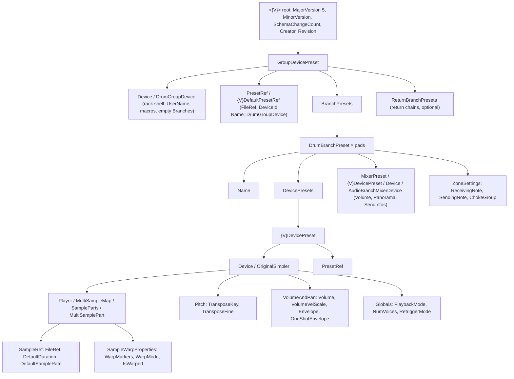

# Drum rack presets (`.adg`): anatomy and the kit mapping (spike, 2026-09-26)

Status: **spike result, provisional.** Epic apricitus-fcd309 under the initiative apricitus-5562e0.
Tasks: reference files apricitus-d577ee, annotation apricitus-661b66, this note apricitus-f2d6c6.
The DAW is not installed on the development Mac. Every finding below comes from files the DAW saved
on other people's machines (public repositories, versions 9.1 to 12.4) and from the vendor's
published object model documentation. Each finding is marked **[DAW-saved]** (read from a file the
DAW wrote), **[docs]** (vendor documentation), **[inferred]** (a consistent pattern with no
counterexample) or **[unknown]**. Nothing here has been checked by opening a file in the DAW. The
"Re-check" list at the end says what to verify once the licensed install is available.

**Naming convention.** The vendor's seven-letter name is never written in this project. It is,
however, the XML root element and part of two element names. In this note:

- `{V}` stands for the vendor's name, so the root element is `<{V}>`, and the element names are
  `{V}DevicePreset` and `{V}DefaultPresetRef`;
- "the DAW" means the application.

A writer must take the literal names from a fixture, for example the root tag of
`daw-12.3-simpler-kit-64.adg`.

## Evidence

Fixtures live in `crates/apricity-daw/tests/fixtures/reference/presets/`. Its `README.md` gives each
file's origin, commit, header and licence.

| Fixture | Saved by | Header (`MinorVersion`, creator) | Used for |
|---|---|---|---|
| `daw-12.3-simpler-kit-64.adg` | DAW | `12.0_12300`, 12.3.2 | the preset tree, Simpler fields, parameter ranges, file references |
| `daw-12.3-drum-sampler-kit.adg` | DAW | `12.0_12300`, 12.3.2 | pad notes on a General MIDI layout, choke groups, the Drum Sampler alternative |
| `daw-12.3-simpler-warped.adv` | DAW | `12.0_12300`, 12.3.2 | warp markers inside a sampler, the User Library reference type |
| `../set/public-12.2-broom-bap.als` | DAW | `12.0_12203`, 12.2 | "slice to drum rack": one WAV cut into pads by frames; clip vs sampler warp markers |
| `candidate-*.adg` (3) | this spike | 12.0 / 11.0 | the owner's load test (not evidence yet) |

The fixtures are backed by a larger scratch corpus that is cited but not copied, because the
licences do not allow it:

- about 90 `.adg`/`.adv`/`.als` files;
- 6077 sample parts in total, of them 376 Simpler pads saved by version 12;
- sources: github.com/ben-juodvalkis/{V}-Device-Creator @e702589 (12.1.5 to 12.4.5b7, no licence),
  github.com/ununu-p2p/als-parser (10.1, no licence), github.com/craffel/live-sets (9.1, no licence),
  github.com/andrewcb/alsd (9.1, Apache-2.0);
- github.com/live-daw-tools/als-parser @94fe482 (MIT), whose `Michelle.als` (11.3.21) and
  `Michelle-12.3.als` (12.3.2) are **the same set saved by two versions**.

Vendor docs: the object model reference (LOM) for Max devices at docs.cycling74.com/apiref/lom/ (`Clip`,
`SimplerDevice` and `Sample`) and the reference manual's "Managing Files and Sets" chapter (12).

## The document tree

A preset wraps a *device preset* around each device. The rack's `Device` element is a shell: its
`Branches` list is empty in the preset. **[DAW-saved]** The pads live in the sibling `BranchPresets`
list. In a set (`.als`), the same rack is written as `DrumGroupDevice/Branches/DrumBranch`, and the
pad note sits under `BranchInfo` instead of `ZoneSettings`.



Two details of the XML itself **[DAW-saved]**:

- Values are attributes, `<X Value="…"/>`.
- An automatable parameter is an element whose value is in its `Manual` child, beside
  `AutomationTarget`, `ModulationTarget` and `MidiControllerRange` (`Min`, `Max`). That range is the
  parameter's legal range, and the table below quotes it.

## Annotated minimal skeleton

This is the element set the spike proposes as sufficient; `candidate-trimmed-kit-v12.adg` is exactly
this. Whether the DAW accepts it is **[unknown]** (Q1).

```xml
<?xml version="1.0" encoding="UTF-8"?>
<{V} MajorVersion="5" MinorVersion="12.0_12300" SchemaChangeCount="1" Creator="… 12.3.2" Revision="">
  <GroupDevicePreset>
    <Device>
      <DrumGroupDevice Id="0">
        <UserName Value="kit name"/>              <!-- the rack's title in the device chain -->
      </DrumGroupDevice>
    </Device>
    <BranchPresets>
      <DrumBranchPreset Id="0">                   <!-- one per pad; Id counts 0, 1, 2 … -->
        <Name Value="kick"/>                      <!-- pad name; DAW-saved kits often leave it "" -->
        <DevicePresets>
          <{V}DevicePreset Id="0">
            <Device>
              <OriginalSimpler Id="0">
                <Player><MultiSampleMap><SampleParts>
                  <MultiSamplePart Id="0">
                    <Name Value="kick"/>
                    <KeyRange><Min Value="0"/><Max Value="127"/><CrossfadeMin Value="0"/><CrossfadeMax Value="127"/></KeyRange>
                    <VelocityRange><Min Value="1"/><Max Value="127"/><CrossfadeMin Value="1"/><CrossfadeMax Value="127"/></VelocityRange>
                    <RootKey Value="60"/>          <!-- always 60: SendingNote is 60 -->
                    <Detune Value="0"/>
                    <Volume Value="1"/>            <!-- sample gain, linear -->
                    <SampleStart Value="0"/>       <!-- frames at the file's own rate -->
                    <SampleEnd Value="374849"/>    <!-- last frame index; whole file = frames - 1 -->
                    <SampleRef>
                      <FileRef>
                        <RelativePathType Value="1"/>                  <!-- 1 = relative to this preset's folder -->
                        <RelativePath Value="audio/kick.wav"/>
                        <Path Value="/absolute/path/to/audio/kick.wav"/>
                      </FileRef>
                      <DefaultDuration Value="374850"/>              <!-- frames -->
                      <DefaultSampleRate Value="44100"/>
                    </SampleRef>
                    <SampleWarpProperties>
                      <WarpMarkers>                <!-- seconds in the file → beats; + hidden last marker -->
                        <WarpMarker Id="0" SecTime="0" BeatTime="0"/>
                      </WarpMarkers>
                      <WarpMode Value="0"/>        <!-- 0 Beats, 2 Texture, 3 Re-Pitch, 4 Complex -->
                      <IsWarped Value="false"/>
                    </SampleWarpProperties>
                  </MultiSamplePart>
                </SampleParts></MultiSampleMap></Player>
                <Pitch>
                  <TransposeKey><Manual Value="0"/></TransposeKey>    <!-- semitones -48..48 -->
                  <TransposeFine><Manual Value="0"/></TransposeFine>  <!-- cents -50..50 (the Detune knob) -->
                </Pitch>
                <VolumeAndPan>
                  <Volume><Manual Value="0"/></Volume>                <!-- dB -36..36 -->
                  <VolumeVelScale><Manual Value="0.35"/></VolumeVelScale> <!-- 0..1, "Vel" -->
                  <Envelope><ReleaseTime><Manual Value="4"/></ReleaseTime></Envelope> <!-- ms 1..60000 -->
                </VolumeAndPan>
                <Globals><PlaybackMode Value="0"/></Globals>          <!-- 0 classic, 1 one-shot, 2 slicing -->
              </OriginalSimpler>
            </Device>
          </{V}DevicePreset>
        </DevicePresets>
        <ZoneSettings>
          <ReceivingNote Value="92"/>             <!-- 128 - MIDI note: 92 = C1 = 36 = pad 1 -->
          <SendingNote Value="60"/>
          <ChokeGroup Value="0"/>                 <!-- 0 none, 1..16 -->
        </ZoneSettings>
      </DrumBranchPreset>
    </BranchPresets>
  </GroupDevicePreset>
</{V}>
```

If the trimmed file is refused, the fallback is `candidate-full-kit.adg`. It is built by copying a
DAW-saved Simpler branch, keeping every element, and changing only the fields in the mapping table.
Its pad XML is about 40 KB per pad before gzip, which is fine for a writer that uses a template.

## Answers

### Q1. Minimal preset

- **Root [DAW-saved].** The root is `<{V} MajorVersion="5" MinorVersion="<major>.0_<build>" SchemaChangeCount Creator Revision>`.
- **Headers seen:**
  - 9.1: `9.0_305`;
  - 9.5 to 9.7: `9.5_327`;
  - 10.0: `10.0_370`;
  - 10.1: `10.0_377`;
  - 11.3: `11.0_11300`;
  - 12.0: `12.0_12049`;
  - 12.1: `12.0_12117` and `12.0_12120`;
  - 12.2: `12.0_12203`;
  - 12.3: `12.0_12300`;
  - 12.4: `12.0_12402`.
- **Preset structure [DAW-saved].** A drum rack preset is `GroupDevicePreset` holding
  `Device/DrumGroupDevice`, `PresetRef`, `BranchPresets/DrumBranchPreset*` and
  `ReturnBranchPresets`. A single-device preset (`.adv`) has the device directly under the root.
- **What the DAW refuses to load without [unknown]:** nothing here opened a file in the DAW. There are
  two indications that it fills in defaults for missing elements:
  - **Upgrade diff [DAW-saved].** The same set saved by 11.3.21 and by 12.3.2 differs only by
    *added* paths: 48 under `OriginalSimpler`, among them `RoundRobin*`, `SourceHint` and
    `MpePitchBendUsesTuning`. No path is removed. So version 12 loads 11-era files that lack its
    newer elements.
  - **A script-edited preset.** A preset edited by a script in an unlicensed repository (12.1.5
    header) has `FileRef` elements holding only `Path` and `RelativePath`. Its author reports that
    it loads.

  The two trimmed candidates test whether the version in the header decides which elements may be
  missing.

### Q2. Pad notes

- **The note is stored inverted [DAW-saved].** `DrumBranchPreset/ZoneSettings/ReceivingNote` holds
  **128 − MIDI note**, so pad 1 (C1 = 36) is **92**.
  - In `daw-12.3-drum-sampler-kit.adg` the pads follow the General MIDI drum map: the kick is on 92
    (36), side stick 91 (37), snare 90 (38), clap 89 (39) and closed hat 86 (42).
  - In `../set/public-12.2-broom-bap.als` the DAW's own slicing put "Slice 1" … "Slice 18" of one WAV on 92,
    91, 90 …, that is slice *n* on 128 − (35 + *n*).
  - The 64-pad kit covers 92 … 29, which is notes 36 … 99.
  - An unlicensed repository's notes report that writing 36 "to start at C1" made every pad look
    empty, which fits: 36 stored means note 92.
- **Other zone fields [DAW-saved].** `SendingNote` is 60 on every pad in every file. `ChokeGroup` is 0
  for none, or 1 to 16; the drum sampler kit puts its hats on group 1.
- **In a set** the same three fields are `DrumBranch/BranchInfo/{ReceivingNote,SendingNote,ChokeGroup}`,
  with the same encoding.

### Q3. Sampler per pad (Simpler, `OriginalSimpler`)

All paths below are relative to `OriginalSimpler`. `MSP` stands for
`Player/MultiSampleMap/SampleParts/MultiSamplePart`.

| Setting | Element | Unit, range | Evidence |
|---|---|---|---|
| root key | `MSP/RootKey` | MIDI note; **60 in all 376 DAW-saved 12.x pads** | [DAW-saved] |
| transpose | `Pitch/TransposeKey` | semitones, −48 … 48 | [DAW-saved], range from `MidiControllerRange` |
| detune | `Pitch/TransposeFine` | cents, −50 … 50 (the "Detune" knob; values −4, −20, −21 seen) | [DAW-saved] |
| part detune | `MSP/Detune` | always 0; leave it | [DAW-saved] |
| volume | `VolumeAndPan/Volume` | **dB**, −36 … 36, fresh pad −12 | [DAW-saved] |
| sample gain | `MSP/Volume` | **linear** (1.58489585 = +4 dB, 1.25892544 = +2 dB), fresh 1 | [DAW-saved] |
| pad fader | `MixerPreset/…/AudioBranchMixerDevice/Volume` | linear, 0.000316 (−70 dB) … 1.995 (+6 dB) | [DAW-saved] |
| start / end | `MSP/SampleStart`, `MSP/SampleEnd` | **frames at the file's own rate**; of 5765 parts starting at 0, 5749 end at `DefaultDuration − 1` (22.05, 44.1, 48 and 96 kHz files) | [DAW-saved] |
| playback mode | `Globals/PlaybackMode` | 0 classic (note-off releases), 1 one-shot, 2 slicing | [docs] `SimplerDevice.playback_mode`, [DAW-saved] 0/1/2 all seen |
| release | `VolumeAndPan/Envelope/ReleaseTime` | ms, 1 … 60000, default 50 | [DAW-saved] |
| attack | `VolumeAndPan/Envelope/AttackTime` | ms, 0.1 … 20000 | [DAW-saved] |
| one-shot fades | `VolumeAndPan/OneShotEnvelope/{FadeInTime,FadeOutTime}`, `SustainMode` | ms 0 … 2000; SustainMode 0 trigger, 1 gate | [DAW-saved] |
| loop off | `Player/LoopModulators/LoopOn` false; `MSP/SustainLoop/Mode` 0 | | [DAW-saved] |
| reverse | `Player/Reverse` | bool | [DAW-saved] |
| voices | `Globals/NumVoices`, `Globals/RetriggerMode` | index; bool | [DAW-saved] |

Frames at the file's rate: `SampleEnd = DefaultDuration − 1` holds at every rate seen. Slices cut
by the DAW share the boundary frame: slice *n* ends on the frame where slice *n* + 1 starts. So
`SampleEnd` is treated as the end position. Whether that frame is inclusive is a one-frame question
and does not matter.

The Drum Sampler (`DrumCell`) is the other per-pad device the DAW uses. It is not suitable:

- its start and length are fractions (`Voice_PlaybackStart`/`Voice_PlaybackLength`, 0 … 1), not
  frames;
- its detune (`Voice_Detune`) spans −0.5 … 0.5;
- it has no warping.

### Q4. Warping inside the sampler

- **Same element as a clip [DAW-saved].** Markers are
  `MSP/SampleWarpProperties/WarpMarkers/WarpMarker Id SecTime BeatTime`: `SecTime` is seconds into the
  file and `BeatTime` is beats. The element and its attributes are **identical** to an audio clip's
  `AudioClip/WarpMarkers/WarpMarker`; `../set/public-12.2-broom-bap.als` has both.
- **Whole-file markers [DAW-saved].** A sampler's markers describe the whole file, even when
  `SampleStart`/`SampleEnd` narrow it. All slices of one file carry the same list. Marker beat 0 may
  sit after 0 s: a warped slice has (2.5537 s, beat 0).
- **Hidden last marker [DAW-saved] [docs].** Every marker list ends with an extra marker 1/32 beat
  (`BeatTime` + 0.03125) after the last real one. The object model docs say this hidden marker "is
  used to calculate the BPM of the last segment".
- **Warp on/off:** `IsWarped` true/false; `WarpMode` is beside it.
- **Warp modes [docs].** `Sample.warp_mode` values are 0 Beats, 1 Tones, 2 Texture, 3 Re-Pitch,
  4 Complex, 6 Complex Pro. Clips also have 5 (REX). The files show 0, 3 and 4 in samplers.
- **Mode-specific fields [DAW-saved].** `GranularityTones`, `GranularityTexture`,
  `FluctuationTexture`, `ComplexProFormants`, `ComplexProEnvelope`, `TransientResolution`,
  `TransientLoopMode` and `TransientEnvelope` sit beside `WarpMode`, with the same names as in a clip.

### Q5. File references

- **`FileRef` fields [DAW-saved].** `SampleRef/FileRef` holds `RelativePathType`, `RelativePath`,
  `Path` (absolute), `Type` (2), `LivePackName`, `LivePackId`, `OriginalFileSize`, `OriginalCrc` and,
  in 12, `SourceHint`.
- **Also in `SampleRef` [DAW-saved]:**
  - `LastModDate`, in Unix seconds;
  - `DefaultDuration`, in frames;
  - `DefaultSampleRate`;
  - `SamplesToAutoWarp`;
  - `SourceContext`, which keeps the reference the sample was first dragged from, and is optional
    in the sense that a device preset leaves it empty.
- **`RelativePathType` values [inferred]**, from every file reference in the corpus:

  | Value | Relative to | Example |
  |---|---|---|
  | 0 | nothing (no file) | empty preset refs |
  | 1 | the folder of the document holding the reference (preset or set) | `../../vidvo/…/4bit_ClapTops2.wav` from a set |
  | 3 | the set's project folder | `Samples/Processed/Crop/Slice 1 ….wav` |
  | 5 | a pack or the Core Library root (`LivePackName`, `LivePackId` filled) | `Samples/One Shots/Drums/Kick/Kick Leftover.wav` |
  | 6 | the User Library | `Samples/Imported/….rx2` |
  | 7 | the app's built-in folder | impulse responses |

- **Both kinds of path [DAW-saved].** The DAW always writes both `Path` and `RelativePath`. Across
  5840 parts, size and CRC are always filled and never 0. The CRC is 16-bit (maximum seen 65532);
  its algorithm is **[unknown]**.
- **Are size and CRC required? [unknown]** The script-edited preset above suggests not. The
  candidates write 0 to test it.
- **Relinking by relative path when `Path` is wrong [unknown].** The manual does not say. It
  describes the File Manager's automatic search, and says samples may be copied on save depending on
  "Collect Files on Export". The candidates point `Path` at `/Users/Shared/apricity-spike/…` so that
  moving the folder tests it.

### Q6. Velocity

- **Simpler [DAW-saved].** The setting is `VolumeAndPan/VolumeVelScale`, 0 … 1 (shown as "Vel"
  0–100 %). A fresh 12.x pad has 0.35; Core Library kits use 0.45.
- **Drum Sampler [DAW-saved].** It has `Voice_VelocityToVolume`, 0 … 1, at 0.23.
- **The DAW's curve is unpublished [unknown].** One measurement on the vendor's user forum (topic
  233793) says Vel 50 %, Volume −12 dB, velocity 127 is as loud as Vel 0 %, Volume 0 dB. That fits a
  curve spanning about ±24 dB at 100 %, linear in dB around the middle velocity. Under that reading,
  **Vel ≈ 0.60 with Volume lowered by 8.2 dB** tracks Apricity's
  `velocity_db(v) = 40·log10(v/100)` (`crates/apricity-score/src/compile.rs`) within 2.3 dB from
  velocity 40 to 127:

  | velocity | Apricity `velocity_db` | fitted (Vel 0.60) | difference |
  |---|---|---|---|
  | 127 | +4.15 | +6.15 | +2.0 |
  | 110 | +1.66 | +2.28 | +0.6 |
  | 100 | 0.00 | 0.00 | 0.0 |
  | 80 | −3.88 | −4.56 | −0.7 |
  | 64 | −7.75 | −8.20 | −0.5 |
  | 40 | −15.92 | −13.67 | +2.3 |
  | 20 | −27.96 | −18.22 | +9.7 |

  This is **provisional**. It must be replaced by a measurement (owner checklist, step 4) before M1
  specs fix the value.

### Q7. Clip file (confirm only; owned by the sidecar spike)

- **No public `.alc` exists [DAW-saved].** GitHub code search for the extension finds only unrelated
  languages.
- **What a set's `AudioClip` holds [DAW-saved]:**
  - `Name`;
  - `Annotation` (the info text);
  - `CurrentStart`/`CurrentEnd` and `Loop/{LoopStart, LoopEnd, StartRelative, LoopOn, OutMarker,
    HiddenLoopStart, HiddenLoopEnd}`, all in beats when warped;
  - `IsWarped`, `WarpMode` and `WarpMarkers`;
  - `SampleRef/FileRef`, as in Q5;
  - `PitchCoarse`, `PitchFine` and `SampleVolume`.
- **What remains [unknown]:** that an `.alc` wraps this same element, and how an unwarped clip stores
  its region (seconds or beats). This waits for the owner's `clip-warped.alc` and `clip-unwarped.alc`
  and for the sidecar spike (apricitus-9fb5fe).

## The mapping: kit → drum rack preset

These are the names in the crates. `Event` and `TrackInfo` come from `crates/apricity-score/src/compile.rs`,
`KitSpec`, `PadSpec` and `WarpModeSpec` from `score.rs`, and `WarpMarker` from `manifest.rs`.

| Apricity | In the preset | Unit, range | Rule |
|---|---|---|---|
| kit (`KitSpec`, `TrackInfo.kit`) | the `.adg` file; `DrumGroupDevice/UserName` | text | one preset per kit (`Timeline.kits` once apricitus-c74565 lands) |
| slice *n* (`SliceBy`, pad `b.n`) | `DrumBranchPreset`, `ZoneSettings/ReceivingNote = 128 − (35 + n)` | 92 … 36 | pad 1 = C1; more than 92 pads is an error |
| named pad (`PadSpec`: `kick`, `snare`, `hat.closed` …) | `ReceivingNote = 128 − drum note` (kick 36, side stick 37, snare 38, clap 39, closed hat 42, open hat 46, crash 49 …); other names on the free notes, alphabetically | | as planned in the initiative |
| pad name | `DrumBranchPreset/Name`, `MultiSamplePart/Name` | text | the pad's name, or `b.3` |
| pad sound (`PieceInfo.source` → `SourceRef.path`) | `MSP/SampleRef/FileRef` | paths | see Decisions 3 |
| piece region (`PieceInfo.src_start`/`src_end`, source seconds) | `MSP/SampleStart`, `MSP/SampleEnd` | frames = round(s × file rate); whole file ends at frames − 1 | file rate from the WAV header, not the manifest |
| file length | `SampleRef/DefaultDuration`, `DefaultSampleRate` | frames, Hz | from the WAV header |
| pad level (`piece_levels`, `LevelGroup.level_db`) | `VolumeAndPan/Volume` | dB, −36 … 36 | level_db + velocity offset (Q6); clamp and warn outside the range |
| transposition (`Event.semitones`, fixed only) | `Pitch/TransposeKey` | st, −48 … 48 | only when constant for the pad; chord-following cannot be held |
| A440 correction (`Event.tuning_cents` = −`tonal.tuning_cents`) | `Pitch/TransposeFine` | ct, −50 … 50 | 0 when the clip is Re-Pitch, as the compiler does |
| the slice's root | `MSP/RootKey` = 60, `SendingNote` = 60 | | fixed; pitch goes through TransposeKey/TransposeFine |
| warp markers (`rhythm.warp_markers`: `WarpMarker { seconds, beat }`) | `SampleWarpProperties/WarpMarkers/WarpMarker SecTime=seconds BeatTime=beat`, plus the hidden last marker (+0.03125 beat at the last segment's tempo); `IsWarped` true | s, beats | whole-file list, even for a slice |
| warp mode (`WarpModeSpec`) | `SampleWarpProperties/WarpMode` | Beats 0, Texture 2, Repitch 3, Complex 4 | |
| no beat grid, or `Repitch` | `IsWarped` false | | a Re-Pitch clip's `speed` becomes TransposeKey + TransposeFine = 12·log2(speed); warn when it rounds |
| note length (a step's `dur` cut at the note end) | `Globals/PlaybackMode` 0 (classic) | | Apricity cuts a pad at the note's end, as classic mode does |
| `release_s` | `VolumeAndPan/Envelope/ReleaseTime` | ms, 1 … 60000 | release_s × 1000, or 4 ms (the engine's `FADE_S`) when none |
| `attack_s` | `VolumeAndPan/Envelope/AttackTime` | ms, 0.1 … 20000 | |
| velocity (`velocity_db`) | `VolumeAndPan/VolumeVelScale` | 0 … 1 | provisional 0.60 (Q6) |
| loop | `Player/LoopModulators/LoopOn` false | | pads never loop |
| choke | `ZoneSettings/ChokeGroup` 0 | | Apricity has no choke groups |

### What a preset cannot hold

Each of these is warned about with the score line and never dropped silently. Where there is a place
for it, it is the set export (apricitus-6edba8).

- **Chord-following transposition** (`Event.semitones` changing with the harmony): a pad has one
  pitch. It goes to the set export.
- **Pitched melodies on a pad** (`notes` tracks playing scale degrees): a pad is one note. They go to
  the set export, or to a sampler track in it.
- **Reverse** (`Event.reverse`): `Player/Reverse` exists on Simpler, but Apricity reverses per track,
  not per pad. Write it only when every use of the pad is reversed; otherwise it goes to the set export.
- **Filter** (`Event.filter`) and **track effects** (`TrackInfo.effects`, sends, groups): they go to
  the set export.
- **Speed on warped clips** (`TrackSpec.speed` with warping), **humanize** and **swing**: these are
  timing, which the `.mid` file (M2) carries.
- **Track volume** (`TrackSpec.volume`) is not in the preset. It belongs to the set export and is
  folded into nothing here.

## Decisions

These apply the initiative's decisions (comment 63bb5f on apricitus-5562e0). Items 1 to 7 are the
owner's; items 8 to 16 are this spike's proposals for the M1 specs, provisional until the re-check.

1. **Oversized kits:** more pads than notes 36 … 127 (92) is a located error naming the kit and the
   limit. No pads go below C1.
2. **Step pattern proof:** the M2 proof is a Standard MIDI File (`.mid`), not a MIDI clip. The
   preset does not need to carry a pattern.
3. **Audio by default is copied** into a folder next to the preset (`<kit>.adg` + `audio/…`).
   - Each `FileRef` is `RelativePathType` 1 and `RelativePath` `audio/<file>`, with `Path` set to
     the copy's absolute path.
   - With `--no-collect`, `Path` is the library file, and `RelativePath` is computed from the
     preset's folder (still type 1).
4. **Holds and phrases** go in the clip folder (M3), each kind in its own subfolder. They are not
   part of the preset.
5. **A collection's rack** takes items one bar long or shorter.
6. **Kits come from scores only** until saved kits exist.
7. **Naming** follows the sidecar rule (apricitus-f5b805) for clip files. The preset is
   `<kit>.adg`.
8. **Simpler (`OriginalSimpler`), not the Drum Sampler:** Simpler has frame regions and warping.
9. **`RootKey` 60 and `SendingNote` 60 always;** pitch goes through `TransposeKey`/`TransposeFine`,
   as every DAW-saved pad does.
10. **`ReceivingNote` is written as 128 − note.** A conformance test reads it back and asserts that
    pad 1 is 92.
11. **Classic playback mode, with the release from `release_s`** or 4 ms, matching how the engine
    cuts a pad at the note's end.
12. **Warp markers** are written for the whole file with the hidden trailing marker, as a clip
    writer would (shared with the sidecars).
13. **`OriginalFileSize`** is the real byte size. **`OriginalCrc`** is 0 until the CRC algorithm is
    known, and a `LastModDate` of 0 is acceptable. The owner's load test confirms or overturns both.
14. **Header:** the writer copies `MajorVersion`, `MinorVersion` and `SchemaChangeCount` from one
    pinned fixture, and pins the lowest version whose elements it writes. Which version to pin
    (`11.0_11300` or `12.0_12300`) waits for the candidate test.
15. **Template or trimmed.** If the trimmed skeleton loads, the writer emits the trimmed skeleton.
    Otherwise it fills a DAW-saved branch template (`candidate-full-kit.adg`'s approach) and changes
    only the mapped fields.
16. **`design/vocabulary.md`.** This spike does not edit it: sibling sessions own that file. Rows to
    add when M1 lands:
    - **Drum rack preset**: "A kit saved for the DAW: an `.adg` file, one sampler per pad (the
      DAW's word: Drum Rack preset)."
    - **Clip file**: "A clip saved for the DAW: an `.alc` file referencing one sample and region (the
      DAW's word: Clip)."

## Clip folder layout (M3)

The layout is `<out>/<sample>/<kind>/<clip file>`. The kinds are sections, loops, shots, holds and
phrases (decision 4). Automatic markup only.

File names follow the sidecar initiative's rule in apricitus-f5b805, `<letter>-<length>-<key> <clip name>.alc`;
it is not repeated here. Audio is copied or referenced as in decision 3.

## Shared findings (for the set spike apricitus-f838a3 and the sidecar spike apricitus-9fb5fe)

- **File references.** The `FileRef` anatomy and the `RelativePathType` table are in Q5. The DAW
  writes `Path` and `RelativePath` together, plus the file size and a 16-bit CRC of unknown
  algorithm. Sets use type 3 (project folder) for files in the project and type 1 (relative to the
  `.als`) otherwise.
- **Warp markers.** `WarpMarker Id SecTime BeatTime` is the same in clips and in samplers. There is
  always a hidden trailing marker +1/32 beat after the last real one (the object model docs confirm
  it). Warp mode numbers: 0 Beats, 1 Tones, 2 Texture, 3 Re-Pitch, 4 Complex, 5 REX (clips only),
  6 Complex Pro.
- **Version headers.** They are listed in Q1. Saving an 11.3 set in 12.3 only adds elements, and 12
  reads files that lack them. The MIT pair `Michelle.als`/`Michelle-12.3.als` (github.com/live-daw-tools/als-parser
  @94fe482) is a ready-made upgrade diff for the set spike.
- **Frames.** `SampleStart`/`SampleEnd`/`DefaultDuration` count frames at the file's own rate.
  `LastModDate` is in Unix seconds.
- **Drum racks in a set.** They use `DrumBranch/BranchInfo/ReceivingNote`, with the same 128 − note
  encoding. The pad chain is `DeviceChain/MidiToAudioDeviceChain/Devices/OriginalSimpler`.
- **Fixture.** `crates/apricity-daw/tests/fixtures/reference/set/public-12.2-broom-bap.als` is
  an MIT, DAW-saved 12.2 set with audio clips, warp markers and drum racks. The set spike may reuse
  it rather than copy it again.
- **No public `.alc` was found anywhere;** clip files must come from the owner's install.

## Owner checklist (needs the licensed install)

Setup:

1. Generate the test audio with `python3 scripts/daw-fixture-audio.py --out ~/apricity-spike/audio`
   once apricitus-2831a6 lands.
2. Copy `crates/apricity-daw/tests/fixtures/reference/presets/candidate-*.adg` into
   `~/apricity-spike/`, so that the audio sits at `~/apricity-spike/audio/`.

Steps:

1. **Load test (Q1, Q5).** For each candidate in turn:
   1. Drag it from the browser (Places → add folder `~/apricity-spike`) onto a new MIDI track.
   2. Check the rack shows four pads on C1, C#1, D1 and D#1, with the names from the fixture README.
   3. Play each pad and compare it with the README's pad table:
      - pad 2 sounds 3 semitones up and 20 cents flat;
      - pad 3 plays 0.5 s to 2.5 s, 6 dB down;
      - pad 4 follows the set tempo and stops on note-off with a short release.
   4. Note any "sample missing" message: `Path` is deliberately wrong, so a missing sample means the
      DAW does not relink by `RelativePath`.
   5. Then copy the folder to `/Users/Shared/apricity-spike/presets/` (audio in `audio/`) and load it
      again.
   6. Report per candidate: loads / refuses (with the message) / loads with missing samples.
2. **Reference preset (d577ee).**
   1. Build the same four pads by hand: drag each WAV onto a pad of an empty Drum Rack, then set
      pad 2 transpose +3 and detune −20; pad 3 start/end and volume −6 dB; pad 4 Warp on, two
      markers moved, Classic mode, release about 120 ms.
   2. Save the rack as `kit-reference.adg` (rack title bar → save preset). Then change only pad 2's
      receiving note (pad context menu or drag the pad) and save `kit-reference-note.adg`.
3. **Clips (Q7).**
   1. Drop `steady-120.wav` on an audio track, loop one bar, rename it and add an info text, then
      drag the clip to the browser as `clip-warped.alc`.
   2. Turn Warp off on a second clip and save it as `clip-unwarped.alc`.
4. **Velocity (Q6).**
   1. On one pad holding `detuned.wav`, set Vel to 0 %, 35 %, 60 % and 100 % in turn.
   2. For each setting, record notes at velocities 20, 40, 64, 80, 100, 110 and 127, and export the
      audio.
   3. Apricity measures the peak of each note and fits the curve.
5. **Hand back.** Copy all saved files into
   `crates/apricity-daw/tests/fixtures/reference/presets/`, add their version (Help → About) to the
   README, and comment on apricitus-d577ee.

## Re-check when the licensed install arrives

These are exact places to copy from on macOS. The app bundle name contains the vendor's name, so it is written
`<DAW app>` here.

- `/Applications/<DAW app>.app/Contents/App-Resources/Core Library/Samples/One Shots/Drums/`: the
  one-shots the DAW-saved kits reference; copy no audio, only confirm that the paths exist.
- `/Applications/<DAW app>.app/Contents/App-Resources/Core Library/Racks/Drum Racks/`: take two kit
  `.adg` files (one with Simpler pads, one with Drum Sampler pads). Re-run the Q2 and Q3 statistics
  on them.
- `~/Music/<vendor>/Factory Packs/Drum Essentials/`, if installed: the pack behind
  `daw-12.3-simpler-kit-64.adg`. Confirm `RelativePathType` 5 with `LivePackName`.
- `~/Music/<vendor>/User Library/Presets/Instruments/Drum Rack/`: one of the owner's own racks.
  Confirm type 6.
- Any `.alc` under `Core Library/Clips/`, if the edition ships clips, plus the owner's saved
  `clip-*.alc`. This answers Q7.
- The installed version's `MinorVersion` (from any file it saves), to pin decision 14.
- Then re-run the candidates (step 1), and replace every *provisional* mark above with the observed
  answer.
