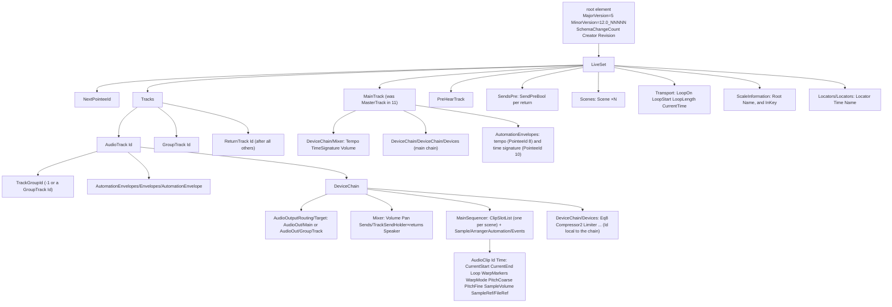

# The DAW set format (`.als`): ground truth and the Apricity mapping (spike, 2026-09-26)

Status: **spike apricitus-f838a3, M0 of the initiative apricitus-6edba8.** Written from sets the DAW
saved that were published in public repositories, because the DAW is not installed on the development
Mac yet (the owner said not to wait). Everything that rests only on public files is marked
*provisional*. It gets re-checked against the owner's own reference sets when the licensed install
arrives: see [Owner steps](#owner-steps) and [Re-check when the licensed install arrives](#re-check-when-the-licensed-install-arrives).
Only the proof set's opening and listening test waits on the DAW.

Words: "the DAW" is the target DAW. A *set* is its `.als` document. The *root element* is the XML
document element, which is named after the vendor. This note never spells that name out: writers copy
the element from the template and never type it.

## Evidence

| # | File (as cited) | DAW version (header `Creator` / `MinorVersion`) | Licence | In fixtures |
|---|---|---|---|---|
| F1 | reasonno1 `tests/fixtures/minimal.als` | 12.3.7 / `12.0_12300` | MIT | `public-12.3.7-minimal.als` |
| F2 | owenbush `packages/core/test/fixtures/Techno … Set.als` | 12.2.1 / `12.0_12203` | MIT | `public-12.2.1-techno.als` |
| F3 | owenbush `packages/core/test/fixtures/Broom Bap.als` | 12.2 / `12.0_12203` | MIT | `public-12.2-broom-bap.als` |
| S1 | Jeff Griffiths' parser repository `tests/test-data/projects/Michelle-12.3.als` (4.1 MB) | 12.3.2 / `12.0_12300` | MIT | no (size) |
| S2 | elixirbeats (abletoolz) `test/version_fixtures/skeletons/{9.0.1 … 12.4.5b}.als`, `abletoolz/data/clip_template.alc` | 9.0.1 … 12.4.5b10 / `12.0_12402` | GPL-3.0 | no |
| S3 | Evilander (Logic-to-DAW converter) `…/data/DefaultLiveSet.als` and its set generator module | 12.1d1 / `12.0_12117` | MIT (the set is the vendor's template) | no |
| S4 | steven-ahfu (suno-to-…) `templates/… 12 Template.als` | 12.1.11 / `12.0_12120` | AGPL-3.0 | no |
| S5 | offlinemark (dawtool) `tests/als/*.als` | 8.1.4 … 12.0b16 | BSD-3-Clause | no (older or beta) |
| S6 | SatyrDiamond (DawVert) `data_main/dataset/<vendor>.dset` and its device converter module | device dataset, no version | GPL-3.0 | no |
| S7 | kevinkirsten (…-als) `README.md`, `src/core/{validate,document,file-ref}.ts` | measured on 10.1.43 and 12.4.3 | MIT | no (code, no sets) |
| S8 | gluon (…12_MIDIRemoteScripts) `…/v2/control_surface/default_bank_definitions.py` | decompiled 12.0 remote scripts | none stated | no |
| D1 | The DAW's object model documentation, Clip: `docs.cycling74.com/apiref/lom/clip/` | current | vendor docs | n/a |
| D2 | The DAW's reference manual, version 12, chapter "Clip View" | 12 | vendor docs | n/a |

Repository names contain the vendor's name, so they are cited by owner, GitHub repository id and
commit (`https://api.github.com/repositories/<id>` resolves each one): F1 reasonno1 1226932927
@`472b24b8`; F2, F3 owenbush 1074927552 @`2ff369a4`; S1 (Jeff Griffiths) 868632244 @`94fe482d`; S2
elixirbeats 235748995 @`9b236183`; S3 Evilander 1158908485 @`a9459fe8`; S4 steven-ahfu 1181781027
@`b74e345c`; S5 offlinemark 309015742 @`44f3e19f`; S6 SatyrDiamond 513498267 @`c6c8be9e`; S7
kevinkirsten 1330635524 @`832e4bce`; S8 gluon 783738637 @`e83d5192`. Git blob ids of the fixtures are
in `crates/apricity-daw/tests/fixtures/reference/set/README.md`. All files were fetched on
2026-09-26 and parsed as data only.

Read a fixture with `gunzip -c crates/apricity-daw/tests/fixtures/reference/set/public-12.3.7-minimal.als | less`.

## Answers at a glance

| # | Question | Answer | Confidence |
|---|---|---|---|
| 1 | Skeleton and version header | Start from the DAW's own default set of the target version and copy its header verbatim. One file cannot open in both the current and the previous major version: a 12 set uses `MainTrack` and `AudioOut/Main` where 11 used `MasterTrack` and `AudioOut/Master`, and an older DAW refuses a newer set. | header shape: confirmed on 8 versions; the exact target header waits on the owner's `empty.als` |
| 2 | Ids | One set-wide pointee space (`AutomationTarget`, `ModulationTarget`, `*ModulationTarget`, `Pointee`, `ControllerTargets.N`): unique, all below `NextPointeeId`. Every other `Id` is local to its list. Track `Id`s are unique among tracks and are what routing strings and `TrackGroupId` point at. | confirmed (F1, F3) |
| 3 | Arrangement audio clip | `AudioClip@Time` and `CurrentStart`/`CurrentEnd` in beats; `Loop` in clip beats when warped, in seconds when not; `WarpMarkers` = (`SecTime` s, `BeatTime` beats) plus a trailing marker 1/32 beat on; `WarpMode` 0 Beats, 1 Tones, 2 Texture, 3 Re-Pitch, 4 Complex, 5 REX, 6 Complex Pro; `PitchCoarse` ±48 st; `PitchFine` −50…49 ct; `SampleVolume` linear gain; no reverse flag (reverse is a processed file); `FileRef` by `RelativePathType` + `RelativePath` + absolute `Path`. | mostly confirmed; clip-gain maximum, fades and name clashes provisional |
| 4 | Tempo, time signature, loop, locators, scale | Tempo and time signature sit on the main track's mixer, with an arrangement envelope whose sentinel event overrides `Manual`; time signature id = 99·log2(den) + num − 1; loop brace in `Transport`; `Locators/Locators/Locator`; `ScaleInformation` Root 0–11 and Name as an index (1 = Minor, 3 = Mixolydian). | confirmed except the scale index table (provisional) |
| 5 | Mixer | Group membership via `TrackGroupId` + `AudioOut/GroupTrack`; returns inside `Tracks` after the others; one `TrackSendHolder` per return; volume and send are linear gain (volume 0.000316…1.995 = −70…+6 dB, send …1 = 0 dB); pan −1…1; sidechain `AudioIn/Track.<id>/PostFxOut`. | confirmed; pan law unknown |
| 6 | Stock devices | EQ Eight, Compressor, Limiter, Saturator, Utility, Reverb, Delay and Auto Filter confirmed on 12.x; Gate on 11.0.12 only; Redux from a GPL dataset only. Table below. | see per device |
| 7 | Automation | `AutomationEnvelope` on the track that owns the parameter, `PointeeId` = the parameter's `AutomationTarget@Id`, `FloatEvent`/`EnumEvent` (`Time` in beats, `Value` in the parameter's own units), first event at the sentinel time −63072000; linear between events; a step is two events at the same time; optional Bézier `CurveControl*`. | confirmed (F1, F3) |
| 8 | Approach | Template-and-patch. The proof set is built and deterministic; it waits on the DAW to be opened. | decision (below); proof pending |

## Document tree (12.x)



## 1. Skeleton and version header

Header (F1): the root element carries
`MajorVersion="5" MinorVersion="12.0_12300" SchemaChangeCount="1" Creator="<vendor> <DAW> 12.3.7" Revision="c92a51f0…"`.
Across the evidence, `MajorVersion` is 4 for versions 8 and 9 and 5 since 10.0. `MinorVersion` is
`<major>.0_<schema build>`: `12.0_12043` (12.0b16), `12.0_12117` (12.1d1), `12.0_12120` (12.1.11),
`12.0_12203` (12.2, 12.2.1, 12.2.6), `12.0_12300` (12.3.2, 12.3.7), `12.0_12402` (12.4.5b10). `Revision`
is the build's commit hash. `SchemaChangeCount` varies within one build (1 to 10), so it is not a
compatibility key.

Compatibility:
- An older DAW refuses a set from a newer one (S7 README; its whole purpose is a 12 → 10 downgrade
  porter). The 11 → 12 break is structural: `MasterTrack` → `MainTrack`, `AudioOut/Master` →
  `AudioOut/Main`, `ScaleInformation/RootNote` + a scale name string → `Root` + an index, and 26
  `LiveSet` children differ, 18 added and 8 removed (S2 11.3.42 vs F1). **So one file cannot serve both the current
  and the previous major version.** Decision 1 of the initiative (current version only) stands.
- Within 12.x the shape drifts a little between minor versions where the export writes. The child
  lists of `LiveSet` and `AudioTrack` are identical in 12.2.1, 12.2.6, 12.3.2 and 12.3.7, and those of
  `AudioClip` in 12.2.1, 12.2.6 and 12.3.2. The differences: 12.1.x lacks `LiveSet/SelectedBreakpointValue`
  and the tracks' `TakeLanesListWrapper`; the track `Mixer` gains `ViewData` in 12.3; 12.4.5b adds
  `AudioClip/AutomationEnvelopesListWrapper` and drops `AudioTrack/NeedArrangerRefreeze`. This is
  why the templates must come from the target version itself.
- Unknown elements and attributes: 10.x rejects a file for a single unknown attribute, and some members
  must be unique per parent (`NeedRefreeze`, `NeedArrangerRefreeze`, `SessionMixer`, …) (S7
  `validate.ts`). Nobody has measured the same for 12.x. So the export writes only elements its template
  already has.

Smallest skeleton: unknown for a set generated from nothing. The DAW's own default sets decompress to
182 KB (12.1d1, S3) and 200 KB (12.3.7, F1). A third party reports that 12.4.3 opens a set that
patches `DefaultLiveSet.als` and adds audio clips with only 14 of the 49 `AudioClip` children a 12.2 clip has
(S3, the generator module's docstring). That suggests the DAW fills defaults for missing children, but
nobody here has verified it (*provisional*). The skeleton is therefore the DAW's own default set for
the target version, from the owner's `empty.als`. Until that exists, F1 serves.

Invariants a writer must keep (F1, F3; S7 `document.ts` `gridIsConsistent`):
- every track's `MainSequencer/ClipSlotList` has one `ClipSlot` per `Scenes/Scene` (8 in F1);
- every track's `Mixer/Sends` has one `TrackSendHolder` per `ReturnTrack`, in return order, and
  `LiveSet/SendsPre` has one `SendPreBool` per return;
- `ReturnTrack`s come after all other tracks inside `Tracks`; a `GroupTrack` comes before its members.

## 2. Ids

Measured on F1 (578 pointee-space ids) and F3 (21,228); F2 agrees (10,511):
- **Set-wide pointee space**: `AutomationTarget@Id`, `ModulationTarget@Id`,
  `{Volume,Transposition,GrainSize,Flux,SampleOffset,TransientEnvelope,ComplexProFormants,ComplexProEnvelope}ModulationTarget@Id`,
  `Pointee@Id` and MIDI tracks' `ControllerTargets.N@Id`. There are no duplicates, and all of them are
  below `LiveSet/NextPointeeId` (F1: max 22181, `NextPointeeId` 22182; F3: 57908 and 57909). The
  pointee space is what envelopes (`PointeeId`) refer to.
- **List-local ids**: `AudioClip`, `WarpMarker`, `Locator`, `AutomationEnvelope`, `FloatEvent`,
  `EnumEvent`, `TrackSendHolder`, `ClipSlot`, `Scene`, `RemoteableTimeSignature` and the devices in a
  `Devices` list are unique within their list only (F3: 135 `AudioClip`s with ids 0–40; devices on
  track 46 have ids 8, 1, 5, 7, 9, 10, 11 in document order). Document order, not `Id` order, is the
  play and chain order. `Locator` ids start at 1 in F1; S3 reports 0-based in 12.4.3. Either works as
  long as they are unique.
- **Track ids** (`AudioTrack@Id`, `GroupTrack@Id`, `ReturnTrack@Id`) are unique among tracks and are
  referenced by `TrackGroupId` and by routing targets (`AudioIn/Track.19/PostFxOut`,
  `AudioOut/Track.20/TrackIn`). F1 uses 2, 3 (returns) and 8, 12, 13, 14. They do not have to be
  distinct from pointee ids.
- Writer rule: when cloning a template track or device, give every pointee-space id a fresh value from
  a counter that starts at the template's `NextPointeeId`, then set `NextPointeeId` to the counter. S3
  renumbers every `Id` globally and reports that 12.4.3 accepts it (*provisional*). The local scheme is
  what the DAW itself writes.

## 3. The arrangement audio clip

Location: `AudioTrack/DeviceChain/MainSequencer/Sample/ArrangerAutomation/Events/AudioClip` (F2, F3;
session clips sit in `ClipSlotList/ClipSlot/ClipSlot/Value/AudioClip`). Here is an F3 clip, trimmed:

```xml
<AudioClip Id="0" Time="16">
  <CurrentStart Value="16" /> <CurrentEnd Value="32" />
  <Loop> <LoopStart Value="0" /> <LoopEnd Value="64" /> <StartRelative Value="0" /> <LoopOn Value="true" />
         <OutMarker Value="64" /> <HiddenLoopStart Value="0" /> <HiddenLoopEnd Value="64" /> </Loop>
  <Name Value="Pink Noise - EDMtips.com" /> …
  <IsWarped Value="true" /> …
  <SampleRef> <FileRef> <RelativePathType Value="6" /> <RelativePath Value="Samples/Pink Noise - EDMtips.com.wav" />
      <Path Value="/Users/owen/Music/…/User Library/Samples/Pink Noise - EDMtips.com.wav" /> <Type Value="2" />
      <LivePackName Value="" /> <LivePackId Value="" /> <OriginalFileSize Value="4130387" /> <OriginalCrc Value="513" />
    </FileRef> <LastModDate Value="1642188102" /> <SourceContext /> <SampleUsageHint Value="0" />
    <DefaultDuration Value="1376781" /> <DefaultSampleRate Value="44100" /> <SamplesToAutoWarp Value="0" /> </SampleRef>
  <WarpMode Value="0" /> … <Fade Value="true" /> <Fades> <FadeInLength Value="0" /> <FadeOutLength Value="0" /> … </Fades>
  <PitchCoarse Value="0" /> <PitchFine Value="0" /> <SampleVolume Value="1" />
  <WarpMarkers> <WarpMarker Id="0" SecTime="0" BeatTime="0" /> <WarpMarker Id="1" SecTime="31.21952380952381" BeatTime="64" />
                <WarpMarker Id="2" SecTime="31.234767717633929" BeatTime="64.03125" /> </WarpMarkers> …
</AudioClip>
```

| Field | Element | Unit and range | Evidence |
|---|---|---|---|
| Position | `AudioClip@Time` = `CurrentStart` | arrangement beats (quarter notes) | F2, F3 |
| End | `CurrentEnd` | arrangement beats, always, warped or not | F3 unwarped clip: `Time=5.625`, `CurrentEnd=16` |
| Start/end in the sample | `Loop/LoopStart`, `LoopEnd` (and `StartRelative`, `OutMarker`, `HiddenLoop*`) | **clip beats when `IsWarped` is true, seconds when false** | F3 unwarped: `LoopStart=1.6193181818181817` = the first warp marker's `SecTime`. S3 reports the same for 12.4.3. |
| Loop on/off | `Loop/LoopOn` | `true`/`false`. Unwarped audio cannot loop (D1). | F2 looped (`CurrentEnd` 64, `LoopEnd` 16), F3 not |
| Warp on/off | `IsWarped` | bool | F3 (123 true, 12 false) |
| Warp markers | `WarpMarkers/WarpMarker@SecTime@BeatTime` | seconds in the sample file ↔ clip beats, both increasing. **The DAW always ends with a marker 1/32 beat after the last real one** (F2: `(8.0, 16.0)`, `(8.015625, 16.03125)`; F3: `BeatTime` 64 then 64.03125). | F2, F3, S1; D1 "pairs of sample times and beat times" |
| Warp mode | `WarpMode` | 0 Beats, 1 Tones, 2 Texture, 3 Re-Pitch, 4 Complex, 5 REX, 6 Complex Pro | D1 (`warp_mode`); F3 has 0 and 4 |
| Transpose | `PitchCoarse` | semitones, −48 … 48 | D1; F3 +7, F2 −7 |
| Detune | `PitchFine` | cents, −50 … 49 | D1 |
| Clip gain | `SampleVolume` | **linear gain**, 1 = 0 dB (F3: 0.5416354537 = −5.33 dB, 0.2731478214 = −11.27 dB). Maximum +24 dB = 15.849 per a third-party device note; D1's `gain` is a 0…1 slider position, not this value. | values ≤ 1 seen; max *provisional* |
| Reverse | none | No clip-level flag exists in 12.x (no `Reverse`/`IsReversed` under any `AudioClip` in F1–F3, S1, S2 12.x). The DAW's reverse writes a new file under `Samples/Processed/Reverse` (D2). | confirmed absence; the reversed-clip shape waits on `clip.als` |
| Fades | `Fade`, `Fades/FadeInLength`, `FadeOutLength` | unit unknown (every file has 0) | *unknown*, because no non-zero example |
| Sample | `SampleRef/FileRef` (below), `DefaultDuration` (frames), `DefaultSampleRate` (Hz), `LastModDate` (Unix s) | | F2, F3 |

Sample references (`FileRef`, 12.x). 12.x writes no `<Data>` alias record, which is what 10.x
used to find files (S7 README and `file-ref.ts`). Children: `RelativePathType`, `RelativePath`,
`Path` (absolute, `/` separators even on Windows), `Type`, `LivePackName`, `LivePackId`,
`OriginalFileSize` (bytes), `OriginalCrc`, and in 12.3 also `SourceHint` (S1).

| `RelativePathType` | `RelativePath` is relative to | Example |
|---|---|---|
| 0 | nothing (empty; `Path` only) | device presets (F1) |
| 1 | the set's folder, may climb with `../` | F3: `../../../Plugins/Splice/…`, S1: `../../Library/…` |
| 3 | the project folder | F2: `Samples/Imported/MARS_PK_120_kick_lunar.wav`; F3: `Samples/Processed/Crop/Slice 1 [2025-06-16 133649].wav` |
| 5 | a pack or the Core Library | F3: `Devices/Instruments/Sampler` |
| 6 | the User Library | F3: `Samples/Imported/…` under the user library |
| 7 | the app's built-in resources | F3: `Devices/Audio Effects/Utility` |

- The collected layout is `<Name> Project/Samples/Imported/<file>` with `RelativePathType` 3 (F2, after
  "Collect All and Save"). Processed audio goes under `Samples/Processed/<Crop|Reverse|…>/`.
- `OriginalCrc` uses an undocumented 16-bit checksum (F2: 43815, F3: 513). S3 writes 0 and reports
  that 12.4.3 opens and plays the set (*provisional*). The export writes 0 unless the owner's test shows
  the DAW complains.
- `Type`: 1 in F2 (a Windows-authored `.wav`), 2 in F3 and S1 (macOS `.wav`). Meaning *unknown*; the
  export copies the template's value.
- Clashing file names when collecting: *unknown* until the owner saves `clip.als` with the two
  `click-tone.wav` files.

## 4. Set-level: tempo, time signature, loop, locators, scale

- **Tempo**: `MainTrack/DeviceChain/Mixer/Tempo/Manual` (BPM; `MidiControllerRange` 60–200 is only the
  MIDI mapping range) with `AutomationTarget Id="8"`. **The main track always carries an arrangement
  envelope for it** (`MainTrack/AutomationEnvelopes/Envelopes/AutomationEnvelope`, `PointeeId 8`)
  whose first event sits at the sentinel time: `<FloatEvent Id="0" Time="-63072000" Value="120" />`.
  The envelope decides what the arrangement plays, so the export writes the tempo in both places (F1
  also shows `Value="90"` at `Time="16"`: a tempo change).
- **Time signature**: `Mixer/TimeSignature/Manual`, `AutomationTarget Id="10"`, range 0–494, plus an
  `EnumEvent` envelope in the same way. Encoding: `id = 99·log2(denominator) + numerator − 1`. F1: 4/4
  = 201, 3/4 = 200, 6/8 = 302 (`<EnumEvent Id="2" Time="25.5" Value="302" />`); S7 `document.ts`
  gives the same formula. Clips also carry their own `TimeSignature/TimeSignatures/RemoteableTimeSignature`
  (4/4 in every example).
- **Loop brace**: `LiveSet/Transport/LoopOn`, `LoopStart`, `LoopLength` (beats), plus
  `CurrentTime` (the playhead, in beats).
- **Locators**: `LiveSet/Locators/Locators/Locator Id` with `LomId`, `Time` (beats), `Name`,
  `Annotation`, `IsSongStart` (F1: five, e.g. `Time 25.5 Name "C 6-8"`).
- **Scale**: `LiveSet/ScaleInformation/Root` (pitch class, 0 = C … 11 = B), `ScaleInformation/Name`
  (an index into the DAW's scale list), and `LiveSet/InKey` (bool). 104 of F3's 135 clips carry `Root 11 Name 1`
  on B-minor material (the track names say "Bmin"), so 1 = Minor. The full order used here (0 Major,
  1 Minor, 2 Dorian, 3 Mixolydian, 4 Lydian, 5 Phrygian, 6 Locrian, …) is from an MIT tool's table
  (owenbush `packages/core/src/constants/scales.ts`), *provisional*. In 11.x the element was
  `RootNote` plus a name string (`Major`).

## 5. Mixer

- **Volume**: `DeviceChain/Mixer/Volume/Manual`, **linear gain**, `MidiControllerRange` 0.0003162277571
  … 1.99526238, i.e. −70 dB (the fader's −∞) … +6 dB. F3 examples: 0.251188606 = −12 dB,
  0.6531305313 = −3.7 dB.
- **Pan**: `Mixer/Pan/Manual`, −1 (left) … 1 (right). Pan law *unknown*: Apricity uses a balance law
  (`apricity-dsp/src/fx.rs` `balance`: centre unity, never boosts).
- **Sends**: `Mixer/Sends/TrackSendHolder Id=<return index>/Send/Manual`, **linear gain**, 0.0003162277571
  (off) … 1 (0 dB), one holder per return in return order, plus `EnabledByUser`. Pre/post per return
  lives in `LiveSet/SendsPre/SendPreBool` (false = post-fader, which is Apricity's rule). F3: 0.3672822714
  = −8.7 dB.
- **Group tracks**: `GroupTrack Id` has the same children as an `AudioTrack` minus the clip sequencer
  (`MainSequencer`) plus `Slots/GroupTrackSlot` (one per scene). A member has
  `TrackGroupId Value="<group Id>"` and `AudioOutputRouting/Target Value="AudioOut/GroupTrack"`. F2's
  group 24 holds tracks 19, 22, 18, 17, 20 and 21, and they follow it in `Tracks`. Nesting: the inner
  group's own `TrackGroupId` is the outer group's id and it routes to `AudioOut/GroupTrack` (S2 11.0.12:
  group 103 inside 102). No public 12.x file nests groups (*provisional*).
- **Return tracks**: `ReturnTrack Id` inside `Tracks`, after every other track. The same mixer, no
  clips. Its `EffectiveName` is shown with a letter prefix (`A-Reverb`) and its `UserName` is empty
  unless renamed.
- **Main track**: `LiveSet/MainTrack`, devices in `MainTrack/DeviceChain/DeviceChain/Devices` (F3:
  a Limiter).
- **Output routing strings** seen: `AudioOut/Main`, `AudioOut/GroupTrack`, `AudioOut/Track.<id>/TrackIn`,
  `AudioOut/None`, `AudioOut/External/S0`.
- **Compressor sidechain**: `Compressor2/SideChain/OnOff/Manual true` and
  `SideChain/RoutedInput/Routable/Target Value="AudioIn/Track.<key track Id>/PostFxOut"` (F2: all 5 keyed
  from `Kick`, `Track.19`; F3: `Track.27`, `Track.46`). The `UpperDisplayString` and
  `LowerDisplayString` next to it are display only and can be stale (F2 shows an old track name).
  `PostFxOut` is the key track after its devices and before its fader, which is exactly Apricity's key
  (`design/mixer.md`: "their stem after their own effects, before fader").

## 6. Stock devices

A device is an element in `DeviceChain/DeviceChain/Devices` whose tag is the device class. Each
parameter is a child with `Manual` (the value), usually `MidiControllerRange` (`Min`, `Max`), an
`AutomationTarget Id` and often a `ModulationTarget Id`. **Values are in real units (Hz, dB, ms, linear
gain), not normalized.** Class names are confirmed by S8's bank table. Parameter element names and
ranges below come from the file named.

| Apricity (`score.rs`) | Device (class) | Parameters: element = unit, range | Evidence |
|---|---|---|---|
| `eq` (`EqSpec`) | EQ Eight (`Eq8`) | `Bands.0…7/ParameterA/{IsOn, Mode 0–7, Freq 10–22000 Hz, Gain −15…15 dB, Q 0.1–18}`; `ParameterB` is the second channel in L/R or M/S mode; global `Mode` 0 = stereo; `GlobalGain` −12…12 dB. Band `Mode`: 0 low cut 48 dB/oct, 1 low cut 12, 2 low shelf, 3 bell, 4 notch, 5 high shelf, 6 high cut 12, 7 high cut 48. | F3; mode order: S6 (`eq_types`), *provisional* until `devices.als` |
| `comp` (`CompSpec`) | Compressor (`Compressor2`) | `Threshold` linear gain 0.000316…1.995 (F2: 0.2343596071 = −12.6 dB); `Ratio` 1…∞; `Attack` 0.01–1000 ms; `Release` 1–3000 ms; `Knee` 0–18 dB; `Gain` (makeup) −36…36 dB; `DryWet` 0–1; `Model` 0–2 (peak, RMS, expand, *provisional*); `SideChain/…` as above; `GainCompensation` bool | F2 |
| `limit` (`LimitSpec`) | Limiter (`Limiter`) | `Ceiling` −24…0 dB; `Release` 0.01–3000 ms; `AutoRelease` bool; `Gain` −6…6 dB; `Lookahead` 0–2 | F3 (main track) |
| `drive` (`DriveSpec`) | Saturator (`Saturator`) | `PreDrive` −36…36 dB; `Type` 0–7 (curve index, order *unknown*); `PostDrive` −36…0 dB; `DryWet` 0–1; `ColorOn`, `ColorFrequency` 30–18500 Hz | F3 |
| `lofi` (`LofiSpec`) | Redux (`Redux2`) | `BitDepth` 1–16, `SampleRate` 20–40000 Hz, `Jitter`, `DryWet`, `EnablePreFilter`, `EnablePostFilter` | S6 only (GPL dataset), *provisional*. `wow` has no stock match. |
| `noisegate` (`GateSpec`) | Gate (`Gate`) | `Threshold` linear gain 0.000316…1.995; `Attack` 0.02–150 ms; `Hold` 1–1500 ms; `Release` 0.1–3000 ms; `Return` 0–24 dB (hysteresis); `Gain` (floor) −75…0 dB | S2 11.0.12 and S6, *provisional* for 12 |
| `width` | Utility (`StereoGain`) | `StereoWidth` 0–4 (1 = 100 %); `Gain` linear gain 0…56.23 (+35 dB); `Balance` −1…1; `Mono`, `BassMono` | S1 (12.3.2) |
| `reverb` (`ReverbSpec`) | Reverb (`Reverb`) | `DecayTime` 200–60000 ms; `PreDelay` 0.5–250 ms; `RoomSize` 0.22–500; `ShelfHiGain` 0.2–1 with `ShelfHiFreq` 20–16000 Hz (damping); `MixDirect` 0–1 (believed to be Dry/Wet, *provisional*); `MixReflect`, `MixDiffuse` 0.03–1.995 | F1 (return A) |
| `delay` (`DelaySpec`) | Delay (`Delay`) | `DelayLine_SyncL/R` bool; `DelayLine_SyncedSixteenthL/R` index 0–7 = 1, 2, 3, 4, 5, 6, 8, 16 sixteenths; `DelayLine_OffsetL/R` ±0.333 (a fractional shift of the synced time; meaning *provisional*); `DelayLine_TimeL/R` 0.001–5 s (unsynced); `DelayLine_Link` bool; `DelayLine_PingPong` bool; `Feedback` 0–0.95; `Filter_On`, `Filter_Frequency` 50–18000 Hz, `Filter_Bandwidth` 0.5–9 (a band-pass, not separate HP and LP); `DryWet` 0–1 | F1 (return B); step table: S6 |
| track `filter` (`FilterSpec`) | Auto Filter (`AutoFilter`, 12.2+ design) or one EQ Eight band | `FilterType` 0–4; `Cutoff` 20–135 on a pitch scale (Hz = 440·2^((c−69)/12), so 26 Hz…19.9 kHz, *provisional*); `Resonance` 0–1.25; `Slope` bool | S1 |

Unit conversions the writer needs: dB → linear gain `10^(dB/20)` for `Threshold`, `Volume`, `Send`,
`SampleVolume` and Utility `Gain`; s → ms for reverb decay; `beats` → sixteenth-step index plus
offset for delay; share (0–1) → `DryWet` 0–1 unchanged.

## 7. Automation envelopes

```xml
<AutomationEnvelope Id="0">                       <!-- list-local id, on the track that owns the parameter -->
  <EnvelopeTarget> <PointeeId Value="45526" /> </EnvelopeTarget>   <!-- = Eq8 Bands.3/ParameterA/Freq AutomationTarget Id -->
  <Automation> <Events>
    <FloatEvent Id="1" Time="-63072000" Value="22000" />   <!-- sentinel: the value before the first real event -->
    <FloatEvent Id="…" Time="32" Value="22000" />
    <FloatEvent Id="…" Time="32" Value="542.231079" />     <!-- two events at one time = a jump (step) -->
    <FloatEvent Id="…" Time="64" Value="542.231079" />
  </Events> <AutomationTransformViewState> … </AutomationTransformViewState> </Automation>
</AutomationEnvelope>
```

(F3, `AudioTrack 38`, trimmed.) Rules seen in F1 and F3:
- Envelopes sit in the owning track's `AutomationEnvelopes/Envelopes` (device parameters included),
  or in the main track's for tempo and time signature. `PointeeId` is the parameter's
  `AutomationTarget@Id`.
- `Time` is in arrangement beats. `Value` is in the parameter's own units: linear gain for `Volume` and
  `Send` (F3 send: `0.0003162277571` → `0.1678803712` at beat 143), Hz for EQ `Freq`, BPM for tempo, the
  encoded id for time signature (`EnumEvent`).
- Between events the value ramps linearly. A step is two events at the same `Time`. Optional
  `CurveControl1X/1Y/2X/2Y` attributes bend a segment (3 events in F3).
- Event ids are unique within the envelope, not ordered (F3: `Id="56"` precedes `Id="5"`).
- *Unknown*: the domain the DAW interpolates in (the value or the knob position). Apricity ramps volume
  in dB and cut-offs on a log scale (`apricity-engine/src/automation.rs` `scale_for`). Until
  `automation.als` settles it, the export writes extra breakpoints so that either reading stays within
  0.5 dB or 1 % of the engine.

## 8. Approach: template-and-patch, and the proof set

The proof set (task apricitus-d6e7f5) was built by a throwaway scratchpad script from
`apricity compile examples/march-blues.apr` (4 tracks, 56 notes). It uses F1 as the skeleton (its
first audio track cloned per Apricity track, its returns kept) and F2's arrangement `AudioClip` as the
clip template (`AudioClip` children are identical in 12.2, 12.2.1, 12.2.6 and 12.3.2). Output:
`renders/daw-proof/March Blues Proof Project/March Blues Proof.als` (git-ignored, byte-identical on
two runs), with `march-blues-apricity-render.wav` beside it for the A/B. Opening it needs the DAW
(owner steps below).

## Apricity → set mapping

One row per `Timeline` field the export uses (`crates/apricity-score/src/compile.rs`: `Timeline`,
`Event`, `TrackInfo`, `BusInfo`, `ChordSpan`, `Lane`; `score.rs`: `MasterSpec`, `Effect`).

| Apricity field (unit) | Set element written | Conversion, range |
|---|---|---|
| `Timeline.tempo` (BPM) | `MainTrack/DeviceChain/Mixer/Tempo/Manual` and the sentinel `FloatEvent` of the main-track envelope on `PointeeId` = Tempo's `AutomationTarget@Id` | as is; one tempo per score, so no further events |
| `Timeline.meter` (beats per bar, x/4) | `Mixer/TimeSignature/Manual` and its sentinel `EnumEvent` | `197 + meter` (99·2 + meter − 1) |
| `Timeline.key` ("F mixolydian") | `LiveSet/ScaleInformation/Root`, `/Name`; `LiveSet/InKey` = true | tonic → 0–11; mode → scale index (Major 0, Minor 1, Dorian 2, Mixolydian 3, Lydian 4, Phrygian 5, Locrian 6; *provisional*) |
| `Timeline.length_beats` | `Transport/LoopStart` 0, `LoopLength`, `LoopOn` true; `CurrentTime` 0 | beats |
| `Timeline.harmony[]` (`ChordSpan.start_beat`, `.label`) | `Locators/Locators/Locator` (`Time`, `Name`) | one at each change of `label` (decision 3); ids 1… |
| `Timeline.sources[].path` | `AudioClip/SampleRef/FileRef` (`RelativePathType` 3, `RelativePath` `Samples/Imported/<file>`, `Path` absolute, `OriginalFileSize`, `OriginalCrc` 0), `DefaultDuration` (frames), `DefaultSampleRate` | the file is copied into `<Name> Project/Samples/Imported/`; `--no-collect` uses type 1 and a relative path from the set's folder |
| `TrackInfo.name` | `AudioTrack/Name/UserName` (and `EffectiveName`) | as is; overlapping notes: `GroupTrack` named after the track holding `<track> 1`, `<track> 2`, … (decision 2) |
| `TrackInfo.pan` (−1…1) | `Mixer/Pan/Manual` | as is (law differs, see open questions) |
| `TrackInfo.out` ("master" or a group) | `DeviceChain/AudioOutputRouting/Target` `AudioOut/Main` or `AudioOut/GroupTrack` + `TrackGroupId` = the group's track `Id` | |
| `TrackInfo.sends` (return → linear 0–1) | `Mixer/Sends/TrackSendHolder[i]/Send/Manual`, i = the return's position | as is, floored at 0.0003162277571 (off) |
| `TrackInfo.effects[]` | `DeviceChain/DeviceChain/Devices/<Class Id=n>` in order, from captured device templates | per the device table |
| `TrackInfo.filter` (`FilterSpec` lp/hp Hz) | EQ Eight band `Mode` 6 (high cut 12) or 1 (low cut 12), `Freq` | Apricity's filter is one RBJ biquad (12 dB/oct); `Event.filter` that varies per note is an open question |
| `TrackInfo.automation[]` (`Lane`) | `AutomationEnvelopes/Envelopes/AutomationEnvelope` (see below) | |
| `TrackInfo.level_db`, `retune_cents`, `varispeed` | none on the track: already inside each `Event` (`gain_db`, `tuning_cents`, `warp`) | |
| `Event.start_beat` | `AudioClip@Time`, `CurrentStart` | beats |
| `Event.dur_beats` | `CurrentEnd` = start + dur; `Loop/LoopStart` 0, `LoopEnd` = `OutMarker` = `HiddenLoopEnd` = dur; `LoopOn` false; `StartRelative` 0 | clip beats (warped) |
| `Event.warp[]` (source s, beats from note start) | `WarpMarkers/WarpMarker@SecTime@BeatTime` + a trailing marker at `BeatTime + 1/32` with the last segment's slope; `IsWarped` true | 1:1; `src_start`/`src_end` are implied by the first and last markers |
| `Event.mode` | `WarpMode` | `beats` 0, `texture` 2, `repitch` 3, `complex` 6 (Complex Pro, decision 4) |
| `Event.semitones` + `Event.tuning_cents` | `PitchCoarse` (−48…48), `PitchFine` (−50…49) | total = 100·st + ct, coarse = round(total/100), fine = remainder, moved into −50…49 |
| `Event.gain_db` (track volume + level match + velocity) | `SampleVolume` | `10^(dB/20)`, 0.0003162277571 … 15.85 (+24 dB, *provisional*); any excess goes on a Utility (decision below) |
| `Event.reverse` | a reversed copy of the region in `Samples/Processed/Reverse/`, warp markers mirrored (`SecTime' = length − SecTime`) | decision 5 |
| `Event.attack_s`, `release_s` | `Fades/FadeInLength`, `FadeOutLength`, `Fade` true | units *unknown*; open question |
| `Event.velocity` | nothing (already in `gain_db`) | |
| `Event.piece` (pad or slice) | `AudioClip/Name` (`<clip> <n>` or the pad name) | |
| `BusInfo` kind `group` / `return` | `GroupTrack` / `ReturnTrack` | returns last in `Tracks`, in `Timeline.buses` order |
| `BusInfo.gain_db` | `Mixer/Volume/Manual` | `10^(dB/20)`, fader max +6 dB; excess goes on a Utility |
| `BusInfo.out` | as `TrackInfo.out` | nested groups by `TrackGroupId` |
| `BusInfo.effects`, `.automation` | as for tracks | |
| `MasterSpec.effects` | `MainTrack/DeviceChain/DeviceChain/Devices`, ending in a Limiter (−1 dB if none) | as `master.rs` |
| `MasterSpec.loudness` (LUFS) | a Utility `Gain` placed just before the last Limiter on the main track | make-up measured by the engine (±24 dB, `master.rs` `loudness_gain`) → linear |
| `Lane` `volume` (dB, −60…12) | envelope on `Mixer/Volume` | `10^(dB/20)`, ≤ −60 dB → 0.0003162277571; lanes that exceed +6 dB go on a Utility `Gain` |
| `Lane` `pan` (−1…1) | envelope on `Mixer/Pan` | as is |
| `Lane` `send.<return>` (0–1) | envelope on that `TrackSendHolder/Send` | as is |
| `Lane` `eq.lowcut/highcut` (Hz), `eq.low/high` (dB) | envelope on the band's `Freq` / `Gain` | as is |
| `Lane` `comp.threshold` (dB), `comp.mix` (0–1) | `Compressor2/Threshold` (linear), `DryWet` | dB → linear; as is |
| `Lane` `reverb.mix`, `delay.mix` | `Reverb/MixDirect` (*provisional*), `Delay/DryWet` | as is |
| `Lane` `width` (0–2), `filter` (Hz) | Utility `StereoWidth`; the filter band's `Freq` | as is |
| `Lane.step` | two events at each point's time (hold, then jump) | |

Writers never touch `Timeline.warnings` or `ChordSpan.fit`.

## Decisions

Dated 2026-09-26. The initiative's decisions (apricitus-6edba8, comment "Decisions on the open
questions") are applied as follows; nothing in the evidence makes any of them impossible.

1. **Target version: the current 12.x installed on the owner's machine**; the header and every template
   element are copied from that install's default set. Writing for 11 as well is impossible in one
   file (section 1), which the initiative's decision already rules out.
2. **Overlapping notes: a `GroupTrack` named after the Apricity track, holding `AudioTrack`s
   `<track> 1`, `<track> 2`, …**, filled greedily with the fewest tracks. The track's mix (devices,
   pan, sends, automation) goes on the group; members sit at 0 dB and centre.
3. **Locators at each chord change**, named with `ChordSpan.label` (`I7 (F7)`).
4. **Warp mode: `beats` → Beats (0), `texture` → Texture (2), `repitch` → Re-Pitch (3), `complex` →
   Complex Pro (6).** None of the DAW's modes is Rubber Band; Complex Pro is the closest in quality.
   Apricity's varispeed (`repitch`) becomes Re-Pitch plus warp markers, since in that mode the markers
   set the speed and the pitch follows it.
5. **Reverse: a pre-reversed copy of the region**, written like the DAW's own reverse
   (`Samples/Processed/Reverse/`). There is no reverse flag in 12.x to set anyway.
6. **Loudness: measured by default** and written as a Utility `Gain` just before the last Limiter on
   the main track, where the engine applies it. `--no-measure` leaves it out.
7. Cloud export: out of scope (initiative decision 7).
8. **Approach: template-and-patch.** The skeleton, each track and group, each clip and each device are
   copied from sets the DAW saved (the owner's reference sets), then patched and renumbered. The
   evidence supports it: the DAW's documents carry about 200 KB of view state no one documents, 10.x
   rejects unknown attributes, and a third party's template-derived sets open in 12.4.3 (S3). Nothing
   supports generating every element. The proof set tests this; if the DAW rejects it, revisit here.
9. **Tuning plus transposition**: add them in cents and split into `PitchCoarse` plus `PitchFine` in
   −50…49. `PitchCoarse` covers ±48 semitones; a note beyond that is a located error (march-blues
   uses −5…+7 semitones and −10…+33 cents).
10. **Level beyond the DAW's ranges**: clip gain up to +24 dB (*provisional*) stays on the clip. A
    track or group volume above +6 dB, or a volume lane above +6 dB, goes to a Utility `Gain` (up to
    +35 dB) at the end of the chain. A note louder than +24 dB is reported as a located warning, not
    clipped silently.
11. **Effects with no stock match** go in the export report and in a warning, and are otherwise left
    out: `lofi wow` (Redux has no wow), reverb `type` room/hall/plate (approximated by `DecayTime`
    and `RoomSize`; the type itself is reported), `drive tone` (becomes an EQ Eight high cut after the
    Saturator), delay `highpass`/`lowpass` (Delay has one band-pass: centre = the geometric mean,
    width from the ratio, reported as approximate).
12. **Determinism**: `LastModDate` is written as 0 and `OriginalCrc` as 0; `Id`s come from counters;
    floats use the shortest round-trip form; gzip has `mtime` 0. The proof set is byte-identical
    across runs.
13. **Track volume** stays in each clip's `SampleVolume` (it is already inside `Event.gain_db`), and
    faders are left at 0 dB, so the DAW plays what the engine rendered. Moving the static part to the
    fader instead would be friendlier to edit; open question 3.

## Open questions for the owner

1. Which exact version is installed (the application menu, first menu right of the Apple menu →
   About, or the app's version in Finder → Get Info)? The export's header comes from it.
2. Pan law: the DAW's pan on a stereo track may not match Apricity's balance law. Accept the
   difference, or should the export compensate with Utility `Balance`?
3. Track volume: keep it inside each clip's gain (exact, decision 13) or put it on the fader (easier to
   mix, but the level-match part would still sit on the clips)?
4. Per-note filters (`Event.filter`, used by `filter` on a track line with varying notes) and note
   attack/release: approximate them with clip envelopes or fades, or leave them out and report them?

## Shared findings

For the sibling spikes (sidecars apricitus-9fb5fe, `design/daw-sidecars.md`; presets apricitus-fcd309,
`design/daw-presets.md`). These are the same facts as above, repeated so they can be used without
reading the whole note.

- **Version headers seen** (root element attributes): 8.1.4 `MajorVersion 4 / 8.1_226`; 9.x `4 / 9.x_3xx`;
  10.x `5 / 10.0_370…377`; 11.x `5 / 11.0_433…11300`; 12.0b16 `5 / 12.0_12043`; 12.1d1 `12.0_12117`;
  12.1.11 `12.0_12120`; 12.2–12.2.6 `12.0_12203`; 12.3.2, 12.3.7 `12.0_12300`; 12.4.5b10 `12.0_12402`.
  A `.alc` saved by 12.2.6 (S2 `clip_template.alc`) has the same root element and header and is a
  small whole set: `LiveSet` with one `AudioTrack` whose clip sits in a session `ClipSlot`, plus
  `MainTrack` and `PreHearTrack`, `NextPointeeId 74`.
- **`FileRef` in 12.x**: `RelativePathType` (0 none, 1 relative to the document's folder, 3 relative
  to the project, 5 pack or Core Library, 6 User Library, 7 app built-ins), `RelativePath` (a string
  with `/`), `Path` (absolute), `Type`, `LivePackName`, `LivePackId`, `OriginalFileSize`,
  `OriginalCrc` (undocumented 16-bit; 0 reported accepted by 12.4.3, S3), `SourceHint` (12.3). There is
  no `<Data>` alias record; 10.x needed it (S7).
- **Warp markers**: `WarpMarker Id SecTime BeatTime` (seconds in the file, beats in the clip), always
  followed by one marker 1/32 beat past the last. For unwarped clips the `Loop` fields are in
  seconds. `.asd` files seen (S2, `ununu-p2p`) are binary and start with bytes `06 49`; they are out
  of this note's scope.
- **Parameters** are `Manual` + `MidiControllerRange` + `AutomationTarget Id` in real units; device
  `Id`s are local to their chain; pointee ids are set-wide and below `NextPointeeId`.
- **Synthetic audio**: `scripts/daw-reference-audio.py` writes deterministic `click-tone.wav` files
  into the git-ignored `renders/daw-reference/`. The sidecars spike wrote its own generator in parallel
  (`scripts/daw-fixture-audio.py`: 44.1 kHz mono, with a sha256 check file). The reviewer should keep
  one of the two and move the other's files onto it.

## Owner steps

No DAW knowledge assumed. On the Mac where the licensed DAW is installed, in Terminal:

```sh
cd ~/Projects/Apricity
analysis/.venv/bin/python scripts/daw-reference-audio.py     # writes renders/daw-reference/click-tone.wav and clash/click-tone.wav
mkdir -p ~/Desktop/daw-reference
```

For each set below: start the DAW, press **⌘N** (File menu → new set), make the changes, then use
**File → Collect All and Save**. When asked, save into `~/Desktop/daw-reference/` with the file name
given, and answer **Yes** to copying files into the project. Then close the set (**⌘W**) without saving
again.

- **`empty`**: change nothing. Collect All and Save as `empty`.
- **`clip`**:
  1. Press **Tab** until the long horizontal timeline (the Arrangement) is showing.
  2. Drag `renders/daw-reference/click-tone.wav` from Finder onto the first audio track at bar 1.
  3. Double-click the clip; the clip panel opens at the bottom. Make sure the **Warp** button there is
     lit. Set **Transpose** (the big knob) to +5, the small cents box next to it to −23, and **Gain**
     (the vertical slider) to −6.0 dB.
  4. In the clip's waveform, double-click the grey tick above beats 2, 3 and 4 of bar 2 to make three
     warp markers, and drag each a little to the right.
  5. Drag the same file to bar 5, select that clip, and press **R** (reverse; the panel's "Rev"
     button does the same).
  6. Drag `renders/daw-reference/clash/click-tone.wav` to bar 9. In its clip panel set the warp mode
     menu (under Warp) to **Re-Pitch**.
  7. Set the tempo box (top left) to 99.50 and the time signature box next to it to 3/4.
  8. Drag across bars 1–4 in the thin strip above the timeline to set the loop brace, and turn the
     loop switch on.
  9. Click bar 2 in the timeline, press **Set** (the locator button at the top right of the
     arrangement), then right-click the new marker → Rename → `IV`. Do the same at bar 3 → `V7`.
  10. If the top bar has a **Scale** menu, choose root F and scale Mixolydian.
  11. Collect All and Save as `clip`.
- **`mix`**:
  1. Make four audio tracks (**⌘T** four times). Select tracks 1 and 2 and press **⌘G**
     (group). Select that group and track 3 and press **⌘G** again (a group inside a group).
  2. Press **⌘⌥T** to add a return track.
  3. On track 4, set send A to −12 dB, volume to +3.0 dB and pan to 30R (double-click each control to
     type a value).
  4. Collect All and Save as `mix`.
- **`devices`**: one audio track per device. Drag each from the browser (left panel, Audio Effects)
  onto its own track, then change the values named:
  - EQ Eight: band 1 low cut 12 dB at 80 Hz, band 2 low shelf −3 dB at 200 Hz, bands 3 and 4 bells
    (+2 dB at 1 kHz Q 1.5; −4 dB at 3 kHz Q 4), band 8 high shelf +2 dB at 8 kHz.
  - Compressor: ratio 4:1, threshold −18 dB, attack 10 ms, release 120 ms, knee 6 dB, makeup +3 dB,
    dry/wet 80 %. Open its sidechain section (the small triangle at the top left), switch Sidechain on
    and choose the EQ Eight track, **Post FX**.
  - Limiter: ceiling −1 dB, release 50 ms (Auto off).
  - Saturator: drive +6 dB, type Analog Clip, output −3 dB, dry/wet 100 %.
  - Redux: bit depth 12, sample rate 26 kHz.
  - Gate: threshold −40 dB, attack 1 ms, hold 20 ms, release 100 ms, floor −60 dB.
  - Utility: width 150 %, gain +10 dB.
  - Reverb: decay 1.8 s, predelay 20 ms, dry/wet 25 %.
  - Delay (twice): one synced at 3 sixteenths (a dotted eighth), feedback 35 %, ping pong on; one
    unsynced at 250 ms.
  - Auto Filter: low-pass, 12 dB slope, 800 Hz.
  - Collect All and Save as `devices`.
- **`automation`**: open `devices` and use **Save As** `automation`. Press **A** to show automation.
  Then draw these breakpoints by clicking in the lanes: a volume ramp from −20 dB at bar 1 to 0 dB at
  bar 3 on track 1; a pan step (hard left until bar 2, hard right after) on track 2; send A from −60
  to −6 dB on track 3; the EQ Eight band 8 frequency on the EQ Eight track; the Compressor dry/wet on
  the Compressor track. Collect All and Save.
- **Proof set**: open `renders/daw-proof/March Blues Proof Project/March Blues Proof.als`
  (double-click it in Finder). Write down every dialog, word for word. Press **Space** to play. Check
  that the clips sit on the bar lines and follow the chord locators. Then listen to
  `march-blues-apricity-render.wav` in the same folder (the proof has no loudness make-up, so it will be
  quieter). Note whether the chords, timing and pitch match.
- Finally, zip `~/Desktop/daw-reference` without the `Samples` folders, or just send the `.als`
  files, and note the DAW version (application menu → About).

## Re-check when the licensed install arrives

Copy into `crates/apricity-daw/tests/fixtures/reference/set/` (sets only, never audio), then re-run
the scratchpad checks and update the sections marked *provisional*:

1. `/Applications/<DAW app> 12 <Edition>.app/Contents/App-Resources/Builtin/Templates/DefaultLiveSet.als`,
   the DAW's own skeleton and header (path seen in S3). On Windows it is
   `C:/ProgramData/<vendor>/<DAW> 12 <Edition>/Resources/Builtin/Templates/DefaultLiveSet.als`.
2. The five owner sets above: `empty.als`, `clip.als`, `mix.als`, `devices.als`, `automation.als`.
3. Device defaults as the DAW ships them: `…/App-Resources/Core Library/Devices/Audio Effects/` (and
   `…/Builtin/Devices/Audio Effects/`) → `EQ Eight`, `Compressor`, `Limiter`, `Saturator`, `Redux`,
   `Gate`, `Utility`, `Reverb`, `Delay`, `Auto Filter` (their default `.adv` presets, if present; F3
   shows these folders as `RelativePathType` 5 and 7 targets).
4. Then confirm, in order: the header to write (§1); `OriginalCrc 0` and `LastModDate 0` accepted
   (§3); clip-gain maximum and fade units (`clip.als`); the reversed clip's file and markers; how
   clashing names are collected; scale index for Mixolydian (§4); nested group shape (`mix.als`);
   Gate, Redux, Saturator `Type`, Reverb Dry/Wet, EQ Eight band `Mode` order and Auto Filter units
   (`devices.als`); the envelope interpolation domain (`automation.als`).
