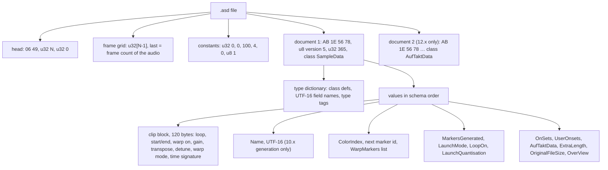
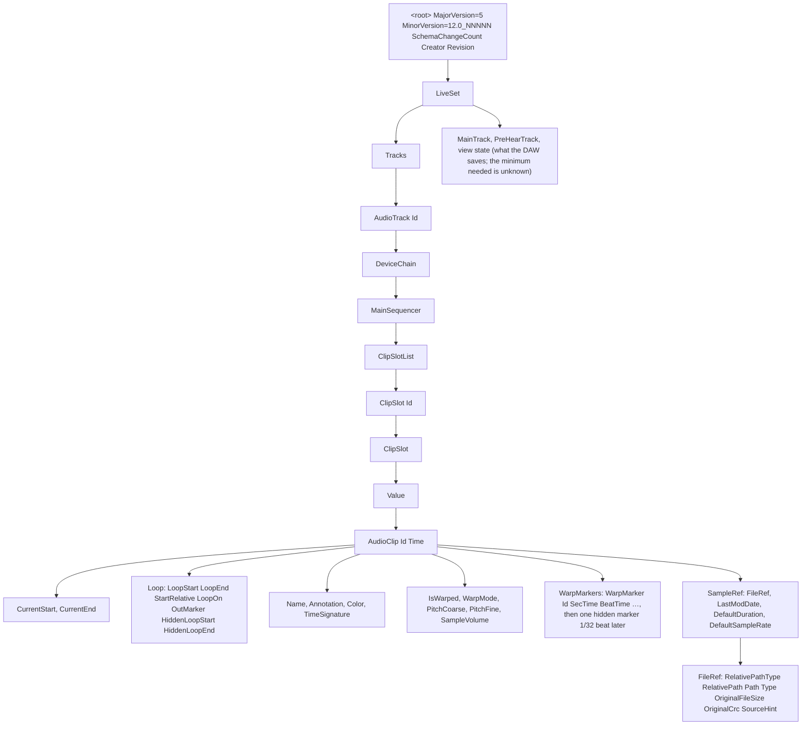
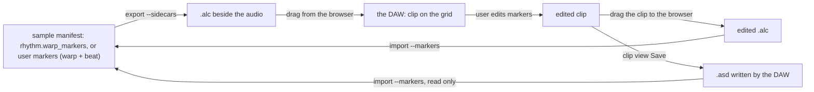

# DAW sidecars: what `.asd` and `.alc` hold, and the go / no-go on writing `.asd` (spike, 2026-09-26)

Status: **spike apricitus-9fb5fe (M0 of initiative apricitus-d7746d)**. Findings rest on public files
and the vendor's published documentation, because the DAW is not installed on this Mac yet. Every
finding that has not been checked against the owner's licensed install is marked *provisional*.
The section "Re-check when the licensed install arrives" lists what to confirm there.

Words: "the DAW" is the target DAW. An `.asd` is its binary per-audio-file *analysis file*. An `.alc`
is a saved *clip file* (gzipped XML). The *root element* of the DAW's XML documents is the vendor's
name, and its `Creator` attribute is the vendor and product name plus the version. This note never
spells either out. It writes `<root>` and `Creator="<vendor> <DAW> 12.3.2"` instead.

## Evidence

| # | File (as cited) | DAW version | Licence | In fixtures |
|---|---|---|---|---|
| A1 | DBraun's `…Parsing` repository (a Python `.asd` parser) @26e8d4b (2025-06-07) `tests/assets/*(loop on\|off).asd` | 10.x generation (the parser's README says it was tested on 9 and 10) | MIT, © 2021 David Braun | `asd/apache-v10-loop-{on,off}.wav.asd` |
| A2 | same repository, `*(loop on\|off <DAW> 12).wav.asd` | 12.x, according to the file names (the exact point release is not recorded) | MIT, © 2021 David Braun | `asd/apache-v12-loop-{on,off}.wav.asd` |
| A3 | adamjmurray `producer-pal` @4fa6b84 (2026-09-12) `e2e/…/samples/*.asd`, `evals/…` (14 files beside 12.3.2 to 12.4.5b10 sets) | 12.3 or 12.4 (inferred from the sets beside them) | GPL-3.0 | no |
| A4 | mollymillions-code `sound-for-editing` @f8cb4ad (2026-04-12), 299 of its 2,983 `.asd` (every tenth file). The repository re-hosts library loops. | 11 or 12 (no `Name` field) | none stated | no |
| A5 | ununu-p2p `als-parser` @71b59b3 (2020-07-22) `test/res/**/*.asd` with the sets that use them | 10.1.15 | none stated | no |
| A6 | ChaseDurand `…-Sample-Tagger` @19ff8f8, diracdeltas `un…` (a set repository), shibco `…-linux`, DBraun `DawDreamer` @727469f | 9.x to 11.x | MIT / MIT / LGPL-2.1 / GPL-3.0 | no |
| A7 | hed0rah `acidcat` @7e3a807 (2026-09-25) `src/acidcat/core/formats/<vendor>.py` and `docs/formats/*anatomy.html`: structure measured over 8,196 `.asd` files | 9.7 to 12 | MIT | no (code and notes) |
| A8 | elixirbeats `abletoolz` @9b23618 (2026-08-22) `abletoolz/asd/FORMAT.md`, `alc.py`, `README.md`, `test/alc_fixtures/audeka_{live_saved,gridfix_verified}.alc`, `data/clip_template.alc` | 12.2.6 | GPL-3.0 | no (cited only) |
| A9 | jtxx000 `extract-warp-markers` @52ec00a (2011) README | 8.x era | none stated | no |
| X1 | 301 public `.als`/`.alc` (dawtool, the Jeff Griffiths parser, als-tools, ben-turner, sdrew712, aparecidoSilvano, berangerqtn, keenaudio, abletoolz, producer-pal and others). **8,488 audio clips with warp markers.** | 8.1.4 to 12.4.5b10 | mixed | no |
| X2 | Jeff Griffiths' parser repository @94fe482 `tests/test-data/projects/Michelle-12.3.als` | 12.3.2 (`12.0_12300`) | MIT | no (16 MB of XML). Its `AudioClip` is the layout of the candidates below. |
| D1 | The DAW's object model documentation, Clip (`docs.cycling74.com/apiref/lom/clip/`) | current | vendor docs | n/a |
| D2 | The DAW's reference manual 12: "Clip View" (saving default clip settings) and "Managing Files and Sets" (analysis files, clip files) | 12 | vendor docs | n/a |

Repositories and paths that contain the vendor's name are cited by owner and repository id.
Every downloaded file was only parsed, never run. The throwaway decoders
(`asd.py`, `xmlscan.py`, `make_alc.py`) stay in the spike's scratchpad.

## §Formats

### The `.asd` analysis file



The layout is little-endian. Offsets are given for `asd/apache-v12-loop-on.wav.asd` (A2, 15,812 bytes).
The fixed parts were checked on all four fixtures, and the section and field names on all 365 files.

| Offset (A2) | Size | Field | Value in A2 | Evidence |
|---|---|---|---|---|
| 0 | 2 | magic `06 49` ('I' = little-endian; `06 4D` = big-endian, PowerPC era) | `06 49` | A7: 7,748 little-endian and 319 big-endian files |
| 2 | 4 | N, the number of grid entries | 200 | |
| 6 | 4 | reserved | 0 | A7: zero in every one of the 8,067 files |
| 10 | 4·(N−1) | frame grid: increasing frame positions, step ≤ 30 ms, **last = the audio's exact frame count** | last = 181,675 | checked against the MIT test WAV beside A1 (181,675 frames) |
| 806 | 21 | constants `u32 0, u32 0, u32 100, u32 4, u32 0, u8 1` | as listed | identical in A1 and A2. A8 reads the first u32 as a table terminator. |
| 827 | 4+1+4 | document magic `AB 1E 56 78`, **u8 version = 5**, u32 = 365 | 5, 365 | the same in 10.x and 12.x files |
| 836 | 1+1+10+4 | root class name (`00`, length, ASCII `SampleData`), then an i32 class-definition count | 19 (A1: 21) | 18 classes in a 12.x file with no markers (A3), 19 with the `WarpMarker` class added |
| 852 | … | type dictionary: class name (u8-length ASCII) + i32 field count (−1 = list, −3 = array), then per field a UTF-16 name (u32 character count) followed by either a class reference or a type tag: `0x10` bool (1 byte), `0x11` i32, `0x12` f32, `0x14` UTF-16 string, `0x17` f64, `0x31`/`0x32`/`0x35`/`0x40` arrays of u8/u16/u32/f32 | | A7, A8. Checked here by reading A1 and A2 to the clip block. |
| **3596** | 48 | `LoopStart`, `LoopEnd`, `SampleOffset`, `HiddenLoopStart`, `HiddenLoopEnd`, `OutMarker`: 6 × f64, **in beats** | 4, 6, −4, 4, 6, 5 | the loop-on and loop-off files differ only here and at 3795. The clip start is `LoopStart + SampleOffset` = 0. |
| 3644 | 4 | `Sync`, `HiQ`, `Fade`, `IsWarped`: 4 × u8 | 1, 1, 1, 1 | |
| 3648 | 16 | `SampleVolume`, `VelocityAmount`, `PitchCoarse`, `PitchFine`: 4 × f32 | 1.0, 0, 0, 0 | the types come from the dictionary (`UserFloat.Value` 0x12) |
| 3664 | 4 | `WarpMode`: u32 | 6 (Complex Pro) | the enumeration is below |
| 3668 | 32 | `TransientResolution` u32, `GranularityTones`/`GranularityTexture`/`FluctuationTexture` f32, `TransientLoopMode` u32, `TransientEnvelope`/`ComplexProFormants`/`ComplexProEnvelope` f32 | 6, 30, 65, 25, 2, 100, 100, 128 | the same defaults as the XML (X2) |
| 3700 | 16 | `TimeSignature`: f32 numerator, f32 denominator, f64 time | 4, 4, 0 | |
| (A1 only) | 4+2n | `Name`: u32 character count + UTF-16 | "Incredible Bongo Band - Apache" | gone from the 12.x files (A2, A3, A4) |
| 3716 | 4 | `ColorIndex`: i32 | 19 (A3: −1) | |
| 3720 | 4 | **the next free marker id** (not the marker count) | 7 | A4: 3 for ids 0,1,2; 4 for ids 2,3; 7 for ids 0,5,6,1,2; 12 for ids 10,11. A8 calls this field the count, which the evidence contradicts. |
| 3724 | 32 each | per marker: `00`, `0A` "WarpMarker", u32 **Id**, f64 **SecTime** (seconds in the audio), f64 **BeatTime** (beats) | (0, 0.0, 0.0), (2, 0.016092…, 0.03125) | A7 matched these values bit for bit against the XML of the set that used the file. The list is in beat order, and Ids need not be (A4: 0, 5, 6, 1, 2). |
| 3788 | 2 | list end `00 00` | | |
| 3790 | 1+4 | `MarkersGenerated` u8, `LaunchMode` u32 | 0, 0 | |
| **3795** | 1 | `LoopOn` u8 | 1 (loop-off file: 0) | the byte-diff of the loop-on and loop-off files |
| 3796 | 4 | `LaunchQuantisation` u32 | 1 | |
| 3800 | … | `OnSets` (u32 count, u32 frame positions, u32 count, f32 energies), `UserOnsets`, `AufTaktData` | 25 onsets | A7 |
| 4051 | 4 | **`OriginalFileSize`**: u32, the audio's size in bytes | 726,746 = the WAV's size | |
| … | | `OverView`: the waveform pyramid (u16 bins, 128 frames per bin) | | A7, A8 |
| 15624 | | document 2: `AufTaktData` (12.x only) | | A8: holds the automatic-warp tempo analysis |

Decoder check: the scratch decoder prints, for all four fixtures, the values that A1's own
tests assert for the same files: start 0, end 5, hidden loop 4..6, and a loop of 4..6 when the loop
is on, 0..5 when it is off. The two generations share this block byte for byte, except for `Name`.
Over the 365-file survey, every file with markers decodes to a warp mode in 0…6, `IsWarped` 0 or 1,
and transpose and detune within their ranges.

**Question 1: where each value lives in the current version.** The table above covers the 12.x
generation (A2, and A3 for 12.3/12.4 files without markers). *Provisional*: A2's point release is not
recorded, so it still has to be checked against a file the owner's 12.x saves.
- **Version marker.** There is no DAW version in an `.asd`. The per-document byte (5) is the same in
  10.x and 12.x. A reader tells the generations apart by their schema. A `Name` string, the
  `BeatTrackState`/`PitchMarks` classes and bare `EstimatedDownBeatLocation` ints mean the older
  generation. A second `AufTaktData` document and 18 or 19 classes mean 12.x. Which of the two
  generations 11.x writes is *unknown*: no public `.asd` is confirmed to come from 11.x.
- **Older versions that matter.** Both little-endian generations: the 12.x schema is the owner's
  install and today's library content, and the 10.x-era schema is older packs and user libraries.
  Big-endian files are PowerPC-era. Import rejects them with a located error.
- **Warp markers are usually absent.** 329 of the 365 surveyed files have an empty marker list, with
  zeros in the clip block (checked on A3). The DAW writes clip data only when the clip view's Save button is pressed
  (D2: "The clip data becomes part of the analysis file that accompanies the sample"; A9). It also
  writes it for audio it records or freezes itself (A5, A6), and library loops ship with it (A4).
  A8 reports that in 12.x the automatic warp writes **no** markers, only the opaque `AufTaktData`
  blob. So a 12.x `.asd` holds warp markers only if someone saved them.

**Question 2: writing `.asd`.**
- **What ties an `.asd` to its audio.** The file name (`<audio file name>.asd` in the same folder,
  for example `x.wav.asd`). `OriginalFileSize` (A7: 96% of 1,200 files beside their audio matched,
  and the rest described an older version of the file). The frame grid's last entry (the exact frame
  count). No checksum or modification time was found in the format. Whether the DAW also checks the
  file's modification time outside the format is *unknown*.
- **Does the DAW honour an `.asd` written by someone else?** Not tested here: it needs the install.
  A8's author wrote a full `.asd` writer and then reports, in the README, that the DAW "ignores
  externally written .asd files and regenerates them", so that tool ships `.alc` files instead.
  *Provisional* (third-party claim; A8 does not say which variants were tried).
- **When the DAW rewrites the file.** On first analysis when none exists (D2: "An analysis file is
  created when a sample is added to a Set for the first time"). On the clip view's Save. On
  re-analysis when `OriginalFileSize` no longer matches (A7). Per A8, also whenever it does not
  accept the file.

### The `.alc` clip file



**Question 3: the document.**
- An `.alc` is a whole set document: the same `<root>` header as an `.als`, a `LiveSet` with one
  `AudioTrack`, and the clip in session slot 0 (A8 `clip_template.alc`, 12.2.6, 1,326 lines). Nothing
  in the content tells an `.alc` from an `.als`, only the extension (A7). The track's devices travel
  with the clip (D2: clip files keep "the original track's devices").
- Header seen in the 12.x files: `MajorVersion="5" MinorVersion="12.0_12203"` (12.2.6) or
  `"12.0_12300"` (12.3.2), plus `SchemaChangeCount`, `Creator` and `Revision`. The sibling note
  `design/daw-set.md` lists every version header.
- The clip, element by element, as a 12.3.2 file writes it (X2):

  | Element | Unit and range | Notes |
  |---|---|---|
  | `AudioClip@Id`, `@Time` | Id local to its list; Time in beats | 0 and 0 in a clip file |
  | `CurrentStart`, `CurrentEnd` | beats, may be negative | A8's accepted hand edit: −191.72 |
  | `Loop/LoopStart`, `LoopEnd`, `OutMarker`, `HiddenLoopStart`, `HiddenLoopEnd`, `StartRelative`, `LoopOn` | clip beats when warped, **seconds when not** | `design/daw-set.md` F3 |
  | `Name` | string | |
  | `IsWarped` | `true`/`false` | |
  | `WarpMode` | enum 0…6 (below) | |
  | `PitchCoarse` | semitones, **−48…48** (D1) | X1: −44…+16 seen |
  | `PitchFine` | cents, **−50…49** (D1), a float | X1: −22.5828…+20 seen |
  | `SampleVolume` | linear gain | |
  | `WarpMarkers/WarpMarker@Id@SecTime@BeatTime` | seconds in the file ↔ beats | `Id` from 10.x on; 8.x/9.x have none |
  | `SampleRef/FileRef` | see below | |
  | `SampleRef/LastModDate` | Unix seconds | |
  | `SampleRef/DefaultDuration`, `DefaultSampleRate` | frames, Hz | |

- **The hidden last marker.** 8,486 of the 8,488 clips in X1 end with a marker exactly 1/32 beat after
  the previous one. D1: "The last Warp Marker … is not visible". The two exceptions are a 12.4.5b10
  set and A8's hand-edited `.alc`, which A8 reports the DAW accepted. So the marker is the DAW's habit,
  and a file without it is still read (*provisional*).
- **Audio references (12.x).** `RelativePathType` 1 means relative to the document's folder, with
  `RelativePath` a plain string such as `steady-120.wav`. `Path` is absolute. Then `Type`,
  `LivePackName`, `LivePackId`, `OriginalFileSize` (bytes), `OriginalCrc` (a 16-bit checksum with an
  undocumented algorithm) and `SourceHint` (12.3). 9.x and 10.x instead used `RelativePathElement`
  lists, a hex UTF-16 `Data` path and `SearchHint` `FileSize`/`Crc`/`MaxCrcSize 16384`.
  `design/daw-set.md` has the full table of `RelativePathType` values. It reports `OriginalCrc` 0
  accepted by 12.4.3 (*provisional*).
- **Audio that has moved.** D2: clips whose samples are missing are marked "Offline" and play
  silence, and the File Manager searches for the files. Whether a type-1 relative path still resolves
  after the `.alc` and its audio move together is *unknown*. The candidate
  `steady-120.relative-only.alc` tests it.
- **The minimal valid document is unknown.** The only public evidence of acceptance (A8) is a
  DAW-saved 12.2.6 `.alc` in which only `CurrentStart`, `CurrentEnd`, the `Loop` values and the two
  `WarpMarker`s were edited. The diff of `audeka_live_saved.alc` against
  `audeka_gridfix_verified.alc` is exactly those 9 lines. So template-and-patch is proven to work
  (*provisional*, third party), and a stripped document is not.
  The candidates below test the stripped forms.

### Question 4: beat numbering

- `BeatTime` is in beats (quarter notes) from 1.1.1 = 0. That is the same origin as Apricity's
  `rhythm.warp_markers[].beat` ("Beat 0 is the first downbeat; pickup beats are negative",
  `schema/sample-manifest.schema.json`).
- **Negative beats exist in files the DAW saved.** In X1, 43 clips in two 9.0.1 sets (aparecidoSilvano)
  pin a marker at beat −122 or −124 near the start of the audio (for example −124 at 0.0035 s) and
  beat 0 at about 57 s. A8's accepted 12.2.6 edit starts the clip at
  −191.72 beats. That is the audio before its first marker (66.88 s × 172 / 60), numbered back from
  1.1.1. So a pickup is representable. Negative *markers* are *provisional* for 12.x:
  `steady-120.full-clip.alc` puts a marker at beat −1.
- **Before the first marker**, the audio plays at the first segment's tempo, extrapolated backwards
  (A8's clip start is exactly that extrapolation, and the DAW accepted it; *provisional*).
  **After the last visible marker** the tempo is the one set by the hidden 1/32-beat marker, which
  the DAW always appends: the last segment's tempo (D1, X1).
- First markers do not have to be at (0 s, beat 0). In X1, 885 clips start at beat 1.005…, 250 at
  beat 32, and 40 at beat −124. In A4, `808 Oracle 6.wav` starts at beat 0.98.

### Question 5: warp modes, transpose and detune

| `WarpMode` | The DAW's name (D1) | Seen in X1 | Apricity `WarpModeSpec` (`crates/apricity-score/src/score.rs`) |
|---|---|---|---|
| 0 | Beats | 7,320 | `Beats` ↔ 0 |
| 1 | Tones | 0 | none (import → `Complex`) |
| 2 | Texture | 0 | `Texture` ↔ 2 |
| 3 | Re-Pitch | 201 | `Repitch` ↔ 3 |
| 4 | Complex | 937 | import → `Complex` |
| 5 | REX (set by the DAW for REX files) | 0 | none (import → `Beats`) |
| 6 | Complex Pro | 30 | `Complex` → 6 on export (the same as `design/daw-set.md` decision 4), 6 → `Complex` on import |

Transpose (`PitchCoarse`) is −48…48 semitones, and detune (`PitchFine`) is −50…49 cents (D1). The
epic's "±50" is off by one at the top: +50 cents is written as +1 semitone and −50 cents. The `.asd`
stores the same two values as f32 (A2, zero in every file surveyed).

## Apricity → format mapping (for M1; units and ranges)

| Apricity (crate / schema name) | `.alc` | `.asd` (read only) | Rule |
|---|---|---|---|
| `Manifest.rhythm.warp_markers[].seconds` (`manifest.rs` `WarpMarker.seconds`, s ≥ 0) | `WarpMarker@SecTime` | `SecTime` f64 | 1:1 |
| `WarpMarker.beat` (beats, 0 = first downbeat, negative = pickup) | `WarpMarker@BeatTime` | `BeatTime` f64 | 1:1 when a sample beat is a quarter note. For other beat units, M1 §Mapping decides. |
| (none) | a hidden marker at last beat + 1/32, with the last segment's slope | the same | Export appends it. Import drops a final marker that sits exactly 1/32 beat after the one before it. |
| `WarpMarker@Id` | 0, 1, 2… in beat order | `Id` u32 + "next id" u32 | Export numbers them in order. Import ignores them. |
| `Rhythm.meter` (beats per bar, x/4 only) | `TimeSignature/…/Numerator`, `Denominator` 4 | `TimeSignature` f32/f32 | |
| `Rhythm.bpm` null, or fewer than 2 markers | `IsWarped false`, `Loop*` in seconds | `IsWarped` 0 | free-time audio |
| `Tonal.tuning_cents` (A440 deviation, cents) | detune d = −tuning_cents, then `PitchCoarse` = ⌊(d + 50)/100⌋ and `PitchFine` = d − 100·coarse, which lands in −50…49.99 | f32 pair | the same split as `design/daw-set.md` decision 9. The engine's `Event.tuning_cents` is already −tuning_cents. |
| `WarpModeSpec` (score) or the derived mode (drum stem → `Beats`, else `Complex`, per the initiative plan) | `WarpMode` 0 / 6 / 2 / 3 | u32 | table above |
| `annotations.clips[]` `{name, start, end}` (s) | `Name`; `CurrentStart`/`CurrentEnd`, `LoopStart`/`LoopEnd`/`OutMarker`/`HiddenLoop*` = the warp map of `start`/`end`, in beats | `LoopStart…OutMarker` f64 (beats) | M3 owns the per-clip files and their names |
| `Source.path` / audio file | `FileRef RelativePathType 1`, `RelativePath` = file name, `Path` = absolute path, `OriginalFileSize` = bytes | `OriginalFileSize` u32 | |
| `Source.sha256` | none. `OriginalCrc` 0 (algorithm unknown) | none | |
| audio frames, rate | `DefaultDuration` (frames), `DefaultSampleRate` | the last grid entry = frames | |
| import direction | `WarpMarker`s → `annotations.markers` named `warp` with `beat`, `source: user` (M4's `Marker.beat`) | the same, from the list | only when a Save has written markers (see Question 1) |

The engine side is unchanged. `Event.warp` (source seconds, beats from the event's start) and
`StretchParams.key_frames` in `apricity-dsp` are built from the markers as they are today.

## §Decision: writing `.asd` is **no-go**

Recommended for the owner's sign-off, applying initiative decision 1 ("accept M0's go/no-go; on no-go,
`.asd` is dropped (not deferred)").

1. **The DAW is reported to discard `.asd` files it did not write.** A8 built a full 12.x `.asd`
   writer and then concluded that the DAW regenerates such files. The DAW's own manual only describes
   analysis files it creates itself. There is no evidence the other way.
2. **Its automatic warp does not use the markers in an `.asd`.** A 12.x file keeps its warp analysis
   in an opaque `AufTaktData` blob (A8). Markers appear only after a Save. Writing markers into a file
   the DAW treats as a cache puts user data where the DAW overwrites it on re-analysis, whenever
   `OriginalFileSize` changes.
3. **The `.alc` does the same job with documented, versioned XML**, and a hand-edited 12.2.6 `.alc`
   is reported to open on the grid (A8). The DAW's browser shows it beside the audio, which is the
   drag-from-library behaviour the initiative wants.
4. **Risk** (initiative decision 1): a proprietary binary that cannot be verified could corrupt the
   DAW's cache for the owner's whole library.

The round trip after this decision:



Therefore:
- **M2 writes an `.alc` beside each analyzed sample.** It goes in the library's `files/audio/<id>/`,
  excluded from sync (initiative decision 2), with `--out <dir>` for a separate folder. The references
  are type 1: the file name relative to the `.alc` plus the absolute path. M3 names the file
  (proposal: `<audio file name>.alc`).
- **M1 builds an `.asd` reader, not a writer.** It reads the 12.x and 10.x-era little-endian layouts
  by walking the type dictionary, not by fixed offsets. The clip block's 120 bytes are the only fixed
  run. Import (M5) reads warp markers, warp on/off, mode, transpose, detune and loop from both
  generations, says "no saved markers" when the list is empty, and rejects big-endian files with a
  located error.
- **The `.alc` writer patches a template.** The template is the `.alc` the owner saves from the
  licensed install (chore apricitus-2c3dfe). A stripped document is used only if the candidate
  tests below show the DAW accepts it.
- If the licensed install proves a hand-written `.asd` *is* honoured (re-check item 6), the owner can
  reopen this decision. Until then there is no `.asd` writer.

## Decisions (initiative apricitus-d7746d, "Decisions" comment) applied here

| Initiative decision | Consequence for the sidecars |
|---|---|
| 1. Accept M0's go/no-go; on no-go `.asd` is dropped | No-go (above). The `.alc` beside the sample is the deliverable. `.asd` is read only. |
| 2. Sidecars beside the library audio in `files/audio/<id>/`, excluded from sync; `--out <dir>` | Type-1 relative reference plus the absolute path, so the folder can move as a unit (to be confirmed by the relative-only candidate) |
| 3. M3 is the single owner of per-sample `.alc` export and naming | This note proposes only the per-sample name. M3's §Naming decides. |
| 4. User warp markers are stored in the manifest and shared | Imported markers become `annotations.markers` (`warp`, `beat`, `source: user`). Export writes the user grid when it exists, else the analysis grid. |
| 5. Markers belong to the recording | Importing an `.alc` or `.asd` of any stem sets the recording's grid. Each stem's sidecar is written from that shared grid. |
| 6. `export --sidecars`, `import --markers`, `--reset-markers` | No change |

## Fixtures and the recipe M1 reuses

`crates/apricity-daw/tests/fixtures/reference/sidecars/` (no audio):

| File | What | Made how | SHA-256 (first 8) |
|---|---|---|---|
| `asd/apache-v10-loop-on.wav.asd`, `…-loop-off.wav.asd` | 10.x generation, two markers, loop 4..6 on / off | copied unchanged from A1 (MIT, © 2021 David Braun) and renamed | `9b3844f4`, `8d59c23a` |
| `asd/apache-v12-loop-on.wav.asd`, `…-loop-off.wav.asd` | 12.x generation, the same clip | copied unchanged from A2 (MIT), renamed | `8774185b`, `022fd027` |
| `candidates/steady-120.full-clip.alc` | the whole 12.3.2 `AudioClip`, markers at beats −1…16 plus the hidden marker, clip −1…16 | hand-written by this spike (`make_alc.py`) | `933b01ca` |
| `candidates/steady-120.bare-clip.alc` | only the mapped elements (markers, start/end, loop, name, warp, mode, pitch, `SampleRef`) | the same | `a8cdac00` |
| `candidates/steady-120.zero-size.alc` | `OriginalFileSize` 0 (`OriginalCrc` is 0 in all candidates) | the same | `fadfbb53` |
| `candidates/steady-120.relative-only.alc` | `Path` points nowhere; only `RelativePath` = `steady-120.wav` can resolve | the same | `827dbd58` |
| `candidates/steady-120.partial.alc` | markers only at beats 0…8 | the same | `9ad1c4ab` |
| `candidates/steady-120.no-tail.alc` | no hidden 1/32-beat marker | the same | `04c957fa` |
| `candidates/tempo-change.alc` | 100 → 120 BPM, markers at every beat plus beat 6.5, Complex Pro | the same | `191ac939` |
| `candidates/detuned.detune-70.alc` | detune −70 cents written as `PitchCoarse −1`, `PitchFine 30`; Beats; loop 0..8 on | the same | `fc8eefd8` |
| `candidates/free-time.unwarped.alc` | `IsWarped false`, loop in seconds | the same | `cc275e28` |

Recipe:
1. Audio comes from `scripts/daw-fixture-audio.py --out <dir>`: 44.1 kHz 16-bit mono clicks,
   byte-identical on every run. The script prints the SHA-256 of each file, and `--truth` prints every
   click as (seconds, beat). The candidates' `SecTime` values are exactly those truth times.
2. Candidates: the root header and the `AudioClip` layout come from X2 (MIT, 12.3.2). Every
   value that matters is replaced. `LastModDate`, `OriginalCrc` and `SourceContext` are emptied.
   gzip uses `mtime` 0. The absolute paths point at `/Users/Shared/apricity-daw-fixtures/`, so the
   owner generates the audio there.
3. M1 adds the owner's DAW-saved `.asd`/`.alc` (chore apricitus-2c3dfe) next to these, with a README
   table of the markers the DAW showed, and `audio.sha256` for `--check`.

## Owner test (the drag-in half of the tasks; needs the licensed install)

On the Mac with the DAW, in Terminal:

```sh
cd ~/Projects/Apricity
python3 scripts/daw-fixture-audio.py --out /Users/Shared/apricity-daw-fixtures --truth
cp crates/apricity-daw/tests/fixtures/reference/sidecars/candidates/*.alc /Users/Shared/apricity-daw-fixtures/
```

In the DAW:
1. The application menu (right of the Apple menu) → About: write down the exact version.
2. In the browser's sidebar, choose **Add Folder…** and add `/Users/Shared/apricity-daw-fixtures`.
3. For each `.alc`, in this order: full-clip, bare-clip, zero-size, partial, no-tail, tempo-change,
   detune-70, free-time, relative-only. Drag it from the browser onto an empty audio track in the
   Arrangement view, and double-click the clip to open the clip view. Record:
   a. Did it load, or did an error or an "Offline" clip appear?
   b. Is Warp on? Which warp mode is shown?
   c. Do the warp markers sit on the clicks? Do the accented (downbeat) clicks fall on bar lines,
      with 1.1.1 on the second click of `steady-120` (the first click is the pickup, at −1)?
   d. Transpose and Detune (detune-70 should show −1 st and +30 ct).
   e. Press Play at 120 BPM and listen: clicks on the metronome?
4. `relative-only`: first run `mv /Users/Shared/apricity-daw-fixtures /Users/Shared/apricity-moved`, re-add
   the moved folder, then drag. Does it find `steady-120.wav`?
5. Hand-patched `.asd` (task apricitus-59a582, step 4). Drag `steady-120.wav` from the browser in.
   In the clip view, set markers at the clicks, and press the Save button in the clip's title bar
   (this writes `steady-120.wav.asd`). Close the DAW and copy the `.asd` aside. Then copy the WAV to
   a new folder, and next to it put the `.asd` with one marker moved (this spike's decoder patches
   it: `SecTime` of marker 2 plus 0.1 s). Drag that WAV in: is the moved marker used? Repeat after
   `touch`-ing the WAV (a new modification time), and with the `.asd` beside a WAV of a different
   length.
6. Send back: the version, the table of results per file, and the saved `.asd`/`.alc` files (chore
   apricitus-2c3dfe lists which ones to save).

## §Open

- **Minimal `.alc` document**: *unknown* until the candidates are dragged in. Template-and-patch is
  the plan either way.
- **`OriginalCrc` algorithm**: *unknown* (16-bit; 9.x computed it over at most 16,384 bytes, per
  `MaxCrcSize`). The candidates write 0. `design/daw-set.md` reports 0 accepted by 12.4.3.
- **Which `.asd` generation 11.x writes**: *unknown*. No public file is confirmed to come from 11.x.
- **Whether the DAW checks the audio's modification time** besides `OriginalFileSize`: *unknown*
  (no time field in the format).
- **Negative marker beats in 12.x**, and the tempo before the first and after the last marker:
  *provisional* (9.0.1 files and a third-party 12.2.6 edit).
- **Beat unit**: `BeatTime` is in quarter notes. Apricity's sample beat is whatever the tracker
  locked onto; the clip's `ratio` already converts. How export treats a 6/8 march (dotted-quarter
  beats) is for M1 §Mapping.
- **`MarkersGenerated`**: 0 in A2 and 1 in X2's clip. What it means is *unknown*. The candidates copy
  X2 (`true`).
- **The meaning of the constants** at offsets 806–826 and of the document header u32 (365): *unknown*.
  They are identical in every file seen, so a reader skips them.

## Shared findings (for apricitus-f838a3 `design/daw-set.md` and apricitus-fcd309 `design/daw-presets.md`)

- **The brand rule collides with the format.** The XML root element of every `.als`/`.alc`/`.adg`
  is the vendor's name, and `Creator` carries the vendor and product name. The spike's candidates
  (gzipped) contain them, because the format requires it; they were copied from the source file, not
  typed. M1 code that writes these documents needs an owner ruling: for example, allow the literal
  only in the writer's source, or take it from the template.
- **Warp mode mapping aligned with `daw-set.md` decision 4**: `complex` → 6 (Complex Pro), with
  Complex (4) and Tones (1) imported as `complex`, and REX (5) as `beats`. `PitchFine` is a float in
  −50…49. Split tuning the same way (d = coarse·100 + fine).
- **The hidden 1/32-beat marker** is the DAW's habit (8,486 of 8,488 clips), but a hand-edited file
  without it was accepted by 12.2.6 (A8). Writers should still append it.
- **Negative beats are legal.** 9.0.1 sets pin markers at beats −122 and −124, and a 12.2.6 clip starts at
  −191.72 beats.
- **`.asd` generation markers**: magic `06 49`; document magic `AB 1E 56 78` with version byte 5 in
  10.x and 12.x alike. The `.asd` names its audio only by file name, and checks `OriginalFileSize`.
- **Two test-audio generators exist**: `scripts/daw-reference-audio.py` (set spike, 48 kHz stereo) and
  `scripts/daw-fixture-audio.py` (this spike, 44.1 kHz mono, as this epic's chore specifies). The
  reviewer should keep one.
- **A1/A2 are MIT `.asd` files for a CC0 recording**: the only permissively licensed `.asd` files
  found, and the only known pair of the same clip from two generations.

## Re-check when the licensed install arrives

Paths use `<vendor>` for the vendor's folder name and `<App>` for the application bundle.

1. The version: `<App>` → About. It replaces "12.x" in A2's provenance here.
2. Save a 12.x `.asd` with markers: task step 5 above (`/Users/Shared/apricity-daw-fixtures/steady-120.wav.asd`).
   Check the clip block at `LoopStart` = the first 120 bytes after the type dictionary, the marker
   list, the "next id" u32 and `OriginalFileSize`.
3. Library `.asd` with saved clips. Run
   `find "/Applications/<App>/Contents/App-Resources/Core Library" ~/Music/<vendor>/"Factory Packs" -name '*.asd' | head -50`
   and copy a drum loop, a one-shot and a Re-Pitch loop. If present, also copy the files named like
   A4's: `Digi Scat 174 bpm.wav.asd` (5 markers, Ids out of order), `Forest Ambience.wav.asd`
   (loop 4..26, `SampleOffset` −4), `808 Oracle 6.wav.asd` (first marker at beat 0.98) and
   `Tabla 130 bpm.aif.asd` (Re-Pitch). Copy only the `.asd` files, never the audio.
4. Library clip files: `find "/Applications/<App>/Contents/App-Resources/Core Library" -name '*.alc' | head`,
   plus one `.alc` the owner drags from an audio track to `~/Music/<vendor>/User Library/Clips/`.
5. An 11.x `.asd`, if any old project on the studio machine has one:
   `mdfind -name .asd | head`, then check the matching set's `Creator`.
6. The hand-patched `.asd` test (owner test step 5). If the DAW honours the moved marker, the
   no-go can be reopened.
7. The `.alc` candidates (owner test steps 3–4). Record the results per file in this note and on
   task apricitus-a1b3f0.
